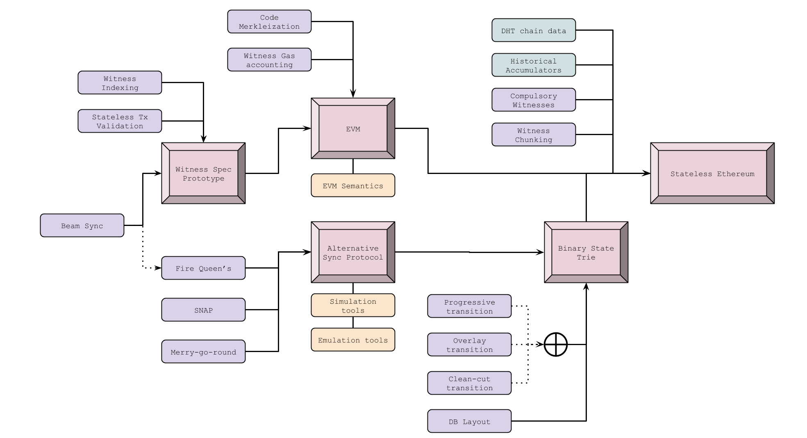

# 路线图

时至今日当我们鸟瞰区块链技术的发展，它仍旧算得上是一个新事物。尽管有关区块链的基础核心概念（例如密码学、去中心化及点对点网络和交易）的研究已经进行了数十年，但可以说是直到2008年比特币的滥觞，这些零散的概念才被整合起来创造出了一个功能性产品。

直到2015年，以太坊逐渐走入人们的视线。至此，以太坊区块链得以成型并且实际可用。尽管计划内升级的日期和细节发生了变化，但以太坊仍坚持不断对协议进行升级，以确保提高其可用性、安全性、功能性和去中心化。

在今年2月的君士坦丁堡升级完成之后，以太坊目前正处于Serenity阶段的风口浪尖，Serenity升级需要通过一系列更新方能达成。然而，居安当思归来源，我们不能忘记自己从哪里来，如此方知来者之可追。以下时间线着眼于以太坊计划内（或计划外）的硬分叉和升级历史，为其下一阶段的升级做好准备。

## **奥林匹克 2015/5/9**

以太坊区块链于2015年7月正式向用户开放使用。以太坊在此之前开放了九个版本的开放测试网络以进行概念证明，其中最后一个版本便是奥林匹克，供开发人员提前探索以太网区块链开放以后的运作方式。Vitalik曾宣布向耗费时间精力对以太坊网络进行压力测试的开发人员提供总额为25,000 ETH的奖励。测试要求很明确：尝试使网络过载，并对网络状态进行极限测试，以便深入了解协议如何处理流量巨大的情况。开发人员需要对四个方面进行测试：交易活动、虚拟机使用、挖矿方式和惩罚机制。

## **边疆 2015/7/30**

经过几个月的压力测试，以太坊网络已准备好发布官方公共主网。7月20日，以太坊的创世区块产生，社区开始逐渐壮大。在Frontier发布前几个月，Vinay Gupta发表了关于以太坊开发过程的说明。该说明的大部分内容虽然十分令人振奋，但同时也发出了对潜在用户的警示。Gupta表示，Frontier是“处于最初始形态”的以太坊版本，开发者应该谨慎行事。Frontier发布前几天，Stephen Taul对开发者作出了与Gupta类似的提醒：“目前的开发者就如同美国边疆扩张时期的拓荒者一般，他们和自己的同伴在开辟新家园时将获得无穷的机会，但同时也将面临许多危险。”

**“边疆”协议包含了以下一系列关键特征：**

* **区块奖励：**在以太坊区块链上，当矿工成功挖掘出一个新区块并使其存在得到确认之后，他们会得到ETH形式的奖励。在此阶段，奖励被定为每个新区快5个ETH。
* **Gas：**在“边疆”诞生之初，每个区块的gas上限被硬编码为5000。这个数量基本上意味着以太坊网络不支持进一步开发。此阶段Gas上限的制定旨在为矿工提供一段缓冲时间，以帮助他们在以太坊网络上的操作走上正轨，同时使得早期开发者安装他们的客户端。几天之后，gas上限被自动移除，以太坊网络能按预期处理交易和智能合约。
* **金丝雀合约：**金丝雀合约被引入“边疆”的目的是提醒用户存在不正当或易受攻击的某条链。它给出的数值只能是0或1。有问题的合约会被赋值为1，因此客户端就能进行识别，避免在无效链上进行挖矿。金丝雀合约的重要意义在于它使得以太坊核心开发团队能够及时制止网络中出现错误的操作或交易。在以太坊发展初期，金丝雀合约虽然显得十分中心化，但却是不可或缺的保护机制。
* **可用性：**所有开发人员的操作都是经由命令行实现，因为完全不存在图形用户界面。虽然可以在以太坊网络中进行操作，但是其用户界面还十分粗糙，它的使用者也在很大程度上局限于具有以太坊背景知识和经验的专业人士。

## **家园 2016/3/14**

“家园”是以太坊网络的首次硬分叉计划，于2016年3月14日发生在第1,150,000个区块上。总的来说，“家园”版本主要为以太坊带来了三大主要更新。第一，取消了金丝雀合约功能，去除了网络中的中心化成分。第二，在以太坊编程语言Solidity中引入了新代码。第三，上线Mist钱包，使用户能够持有或交易ETH、编写或部署智能合约。

“家园”升级是最早的以太坊改进提案（EIP）实施案例之一。EIPs是面向社区提出的改进建议，一旦获得批准，则会囊括在网络升级中。

**“家园”升级主要包括三个EIPs**

**EIP-2：“家园”阶段主要更新** 

EIP 2.1：通过交易创建智能合约的成本被提高至21,000至53,000个gas。通过一个合约创建另一个合约（首选方式）的成本高于通过交易创建合约。通过提高以交易形式创建智能合约的成本，EIP2.1鼓励用户转向以合约创建合约的方式。

EIP 2.2：“s值大于secp256k1n/2的所有交易签名均视为无效。ECDSA恢复预编译合同保持不变并保持接收高s值；这个功能在某些情境下将发挥作用，例如某合同恢复旧的比特币签名。”

EIP 2.3：当合约创建过程中没有足够的gas用以完成操作，该合约将“作废”而非创建一个空白合约。之前的交易可能输出结果包括\[成功\] \[失败\]或者\[空白\]，这一改进则删除了\[空白\]结果。

EIP 2.4：取消用户挖掘稍高难度区块的激励，即增加可挖掘的区块。此升级将新区快产生的时间稳定在每10-20秒之间，并将网络恢复至每块约15秒的总目标时间。

**EIP-7**

“在0xf4添加一个新的操作码，DELEGATECALL，它与CALLCODE的理念类似，不同之处在于前者将发送方和发送值从父范围扩散到子范围，即创建的调用与原始调用具有相同的发送方和发送值。”

**EIP-8：面向未来升级**

EIP-8是一项着眼于未来网络升级计划的改进提案。这一改进旨在确保以太坊上的所有客户端软件都能适应未来的网络协议更新。

## **DAO分叉 2016/7/20**

在以太坊计划内的升级和硬分叉历史中，计划外的DAO事件值得记录。2016年，一个名为The DAO的去中心化自治组织通过发售通证募集了1.5亿美元的资金。同年6月，the DAO遭到黑客入侵，价值5千万美元的ETH被一未知黑客窃取。以太坊社区的大部分成员决定实行硬分叉，将资金返还到原钱包并修复漏洞。然而，这次硬分叉却引来了争议，以太坊社区的小部分成员选择继续在原链上进行挖矿和交易。未返还被盗资金的原链则演变成了以太坊经典（ETC），久而久之受到削弱的原链成为了容易被侵入的对象。而大多数社区成员和核心开发人员选择了分叉链（被盗资金返还至原持有者），这就是我们现在所知的以太坊区块链。

## **大都会 2017-2018**

### **拜占庭硬分叉**

**2017/10/16**

以太坊路线图的下一阶段被称为“大都会”，它将分两个阶段进行：拜占庭和君士坦丁堡。拜占庭将于2017年在第4,370,000个区块上激活。

**其中包括9个EIPs：**

**EIP 100**

调整公式以评估将叔块考虑在内的区块难度。新公式为保证了区块产生速度的稳定性，确保无法通过操纵叔块来强制增加区块高度。

**EIP 658**

对于拜占庭硬分叉升级后的区块，交易收据包括了一个状态字段，用于表示成功（由1表示）或失败（由0表示）。

**EIP 649**

“难度炸弹”\(Difficulty Bomb\)是这样一种机制：一旦被激活，将增加挖掘新区块所耗费的成本（即“难度”），直到难度系数变为不可能或者没有新区块等待挖掘。此时，以太坊网络将处于“冻结”状态。“难度炸弹”机制最初于2015年9月被引入以太坊网络。它的目的是为以太坊最终从工作量证明\(PoW\)转向权益证明\(PoS\)提供支持。从理论上来说，未来在PoS机制下，矿工仍然可以选择在旧的PoW链上作业，而这种行为将导致社区分裂，从而形成两条独立的链：PoS链由验证人\(stakers\)维护，PoW条则由矿工维护。为了预防这种情况的发生，“难度炸弹”机制应运而生。通过增加难度，它将最终淘汰PoW挖矿，并催使网络完全过渡到PoS机制，并且在这个过程中避免了产生具有争议的硬分叉。在此建议中，也被称作“冰河时期”的“难度炸弹”时期将延迟一年，并且区块奖励从5 ETH减少到3 ETH。

了解其他拜占庭硬分叉EIPs可前往Github。

### **君士坦丁堡硬分叉**

 **2019/2/28**

“大都会”升级的第二阶段被称作“君士坦丁堡”，计划于2019年1月中旬在第7,080,000个区块上执行。1月15日，一家名为ChainSecurity的独立安全审计公司发布了一份报告，该报告指出五大主要系统升级其中之一可能会使攻击者有机可乘，以窃取资金。针对该报告，以太坊核心开发者和社区其他成员投票决定推迟升级，直到该安全漏洞得以修复。当月末，以太坊核心开发者宣布升级将于第7,280,000个区块上进行。2月28日，区块高度达到7,280,000，君士坦丁堡硬分叉升级如期执行。目前的以太坊网络处于君士坦丁堡阶段。

**其中主要的EIPs包括：**

**EIP 145：按位移动指令**

在以太坊虚拟机\(EVM\)上增加按位移动指令。这个指令允许二进制信息左右移动。这个改进意味着智能合约的变更执行将便宜10倍。

**EIP 1052：智能合约验证**

允许智能合约只需通过检查另一个智能合约的哈希值来验证彼此。在君士坦丁堡升级之前，智能合约必须提取另一个合约的整个代码才能进行验证，而这样的验证方式需要花费大量时间和精力。

**EIP 1014：智能合约函数CREATE2**

将状态信道引入以太坊网络，促进基于“链下”\(off-chain\)交易的以太坊扩容解决方案。

**EIP 1283：SSTORE操作码**

减少SStore操作码的GAS耗费。这使得交易中多个更新操作的价格更加友好。

**EIP 1234：区块奖励&难度炸弹**

此改进提案包含两大内容：减少区块奖励和延迟难度炸弹。

> **减少区块奖励：**
>
> 将区块采矿奖励从每块3 ETH减少到2 ETH。这个改变也被称作“Thirdening”，即以太坊第三次区块奖励减半。
>
> **推迟“难度炸弹”：**
>
> EIP 1234将“难度炸弹”时期推迟12个月，届时将会进行再次投票。

## **“宁静”\(Serenity\) 2019-2022**

放眼未来，“宁静” \(Serenity\) 是以太坊区块链的终极目的地，但在这之前还需要经历伊斯坦布尔硬分叉和“以太坊1.x”阶段。“宁静” \(Serenity\) 的主要内容包括从工作量证明 \(PoW\) 到权益证明 \(PoS\) 的完全转变，同时也将完成其他重要的升级：引入信标链 \(Beacon Chain\) 、分片 \(Sharding\) 机制；以及用eWASM \(Ethereum-flavored Web Assembly\) 替代以太坊虚拟机 \(EVM\)。

Serenity的所有升级都将分阶段实现，在此期间，以太坊1.x也将持续得到完善，以确保原始PoW链的延续。

首先我们需要明确的是，**eth2升级并非一蹴而就，而是划分成多个阶段逐步进行。**以下内容旨在提供eth2的阶段概况参考，让关注以太坊的爱好者们对升级路线心中有数。

以太坊2.0，也就是大家所熟知的Serenity阶段，秉承着五个设计原则：简洁性、强韧性、持久性、安全性、去中心化。之所以要采用循序渐进的方式实现Serenity，是为了实现以上所有原则，从而进一步将以太坊打造成区块链解决方案的市场领军者。

### ETH 1.x

Eth 1.x 的重点是将当前的以太坊链转移到“无状态客户端”范式，最终目标是顺利过渡成为 Eth 2.0 中的一个执行环境 \(Executive Environment\)。

Eth 1.x 技术路线图[（详解）](https://news.ethereum.cn/eth1x-stateless-tech-tree/)

#### **伊斯坦布尔硬分叉** 

**2019/12**

伊斯坦布尔硬分叉是[Eth1.x](https://docs.ethhub.io/ethereum-roadmap/ethereum-1.x/)阶段的其中一次升级，Eth1.x之后将迎来[Serenity \(ETH2.0\)](https://pages.consensys.net/serenity)，以太坊共识机制也将由目前的PoW（工作量证明）转为PoS（权益证明）。

总的来说，伊斯坦布尔升级将**改变部分操作码的成本**，以防止垃圾区块攻击并且整体上提高拒绝服务（DoS）攻击的弹性。**该**升级提升了以太坊和Zcash以及其它基于Equihash ****\(Zcash挖矿算法\) PoW加密货币的**互操作性**。该升级为操作码带来了一系列改变，有助于提升基于**零知识隐私技术（如SNARKs和STARKs）解决方案**的可扩展性。

#### **伊斯坦布尔升级包含的EIPs**

伊斯坦布尔升级总共收到了11个EIP提交，其中有**6个EIPs**最后被敲定：

* [**EIP-152：**](https://github.com/ethereum/EIPs/blob/master/EIPS/eip-152.md)增加Blake2压缩函数 F预编译。该EIP将使BLAKE2b哈希函数和其他更高阶的64位BLAKE2变体可以在EVM上低成本运行，从而提高以太坊与Zcash以及其它基于Equihash算法的PoW加密货币的互操作性。
* [**EIP-1108：**](https://eips.ethereum.org/EIPS/eip-1108)由于当前椭圆曲线算法预编译的成本过高，因此本EIP计划降低alt\_bn128预编译的gas成本。对预编译进行重新定价将对以太坊上的许多隐私解决方案和扩展解决方案大有裨益。\[5\]
* [**EIP-1344：**](https://eips.ethereum.org/EIPS/eip-1344)当前，还没有关于如何为特定网络设置chain ID的规范，该操作依赖于客户端执行者和区块链社区进行手动选择。该EIP建议使用chain ID来防止不同链之间的重放攻击，并且在处理签名时（尤其是第2层签名方案），在智能合约内部具有同样的可能性将有所帮助。
* [**EIP-1844：**](https://eips.ethereum.org/EIPS/eip-1884)以太坊状态的快速增长导致某些操作码比以往更加占用资源。因此，该EIP对某些操作码进行重新定价，从而在gas支出和资源消耗之间达到良好平衡。
* [**EIP-2028：**](https://eips.ethereum.org/EIPS/eip-2028)调用链上数据需要在以太坊网络上支付gas。该EIP的一部分内容将成本从目前的68 gas/字节降低到16 gas/字节，这将有助于增加带宽，使得更多数据可以容纳在一个区块中。
* [**EIP-2200：**](https://github.com/sorpaas/EIPs/blob/sp-eip-new-net-metering/EIPS/eip-2200.md)为SSTORE操作码提供净gas计量变化的结构化定义，启用新合约存储用法，并且减少大多数执行方式过高的gas费用。

### ETH 2.0

#### Phase 0 

#### 📌 关键词：PoS，信标链

[阶段0](https://github.com/ethereum/eth2.0-specs#phase-0)的主要任务是启动信标链 \(Beacon Chain\)。作为eth2的核心，信标链将为其自身和将来所有的分片链管理Casper权益证明协议，引导着eth2其他所有方面的发展。

正如[Ben Edgington](https://media.consensys.net/state-of-ethereum-protocol-2-the-beacon-chain-c6b6a9a69129)所提到的，该阶段的工作涉及许多方面，包括管理验证者及其押金、选择区块提议者、组织验证者进入委员会、对提议区块进行投票、应用共识规则、验证者的奖惩机制、促进跨分片交易等。

信标链上的主要负载来源将是“证明” \(attestations\)。证明是针对分片区块可用性的见证信息，同时也是信标区块的PoS见证信息。当一个分片区块取得了足够数量的证明，将创建一个“交联” \(crosslink\)，该“交联”可以确认将信标片段（到该分片区块为止）整合到信标链中。

阶段0将使用 Caspe FFG \(the Friendly Finality Gadget/友好的最终确定性小工具\) 来保障最终确定性 \(finality\)。简单来说，最终确定性意味着某项特定操作一旦完成，就将永远铭刻在历史中，并且无法还原。

#### 🔸 ETH2/BETH：信标链新ETH代币

阶段0将引入ETH2/BETH，成为供信标链验证者使用的新资产，主要有两种产生方式：

* 作为信标链的验证奖励分发（阶段1后还包括分片中的验证奖励）；
* 所有ETH1.x用户都通过[注册合约](https://github.com/ethereum/beacon_chain/blob/master/contracts/validator_registration.v.py)（registration contract）以1 ETH的价格购买，合约将其称作deposit。

需要清楚的是，阶段0不支持从信标链中撤回或转移ETH2，ETH1一经存入验证者注册合约后，将在以太坊1.0链中被销毁。信标链验证者会跟踪该合约，并向信标链提交存款信息，然后再由信标链将ETH2发放给存款人。

一旦阶段0激活，将存在两条以太坊区块链：Eth1链（PoW主链）和Eth2链（信标链/PoS链）。 信标链是eth2的基础，也是核心组件，能够起到管理验证者并且协调分片链的作用。

#### Phase 1

#### 📌 关键词：分片，数据可用性，交联

 阶段1的实现以阶段0为基础，主要内容是将数据写入分片链。由于阶段0为分片链奠定了大部分基础工作，阶段1实现的复杂程度比其他组件要低得多。

分片链是将来可扩展性的关键，因为其允许并行处理交易而大大提升了吞吐量，目前最新方案是在阶段1中部署64个分片（将来或许会更多）。

阶段1主要涉及在分片链写入数据，并实现其有效性和共识性。分片链尚未拥有账户、资产或智能合约。由于缺乏支持并行处理交易的执行环境，阶段1更像是试运行分片结构，而不是直接借助分片进行扩展的尝试。

\*\*\*\*🔗 **交联 Crosslink**

每个分片的当前状态（“组合数据根”）会周期性地记录在信标链区块中，作为交联，其中包含自上一个交联以来给定分片中的所有区块。当信标链区块最终确定后，相应的分片区块也将被视为最终确定，如此其他分片可以信任该分片并进行跨分片交易。

交联是：

* 委员会的一个签名集合，作为分片链中某个区块的证明（attestation），证明其可以被添加进信标链中；
* 信标链获取分片链状态更新的主要方式；
* 异步跨分片通信的基础设施。

信标链在各个slot中为每个分片随机分配的验证者，只是就分片区块的内容达成共识，而要证明分片的内容和状态，则需要通过交联。在阶段 2 甚至更高阶段，交联将支持跨分片通信（Cross-Shard Communication）。

#### Phase 2

#### 📌 关键词：状态执行，执行环境，eWASM，跨分片通信

阶段2的许多功能目前还处于积极研发阶段。

可以明确的是，阶段2将能够整合系统各部分的功能性。分片链将从简单的数据容器过渡到结构化的链状态，并重新引入智能合约。每个分片将管理基于[eWASM](https://github.com/ewasm/design)的虚拟机，支持帐户、合约、状态以及solidity中为人所熟知的其他抽象。在阶段2之前或阶段2内或有希望使得常见的开发者工具支持eWASM，如truffle、solc、ganache。

阶段2还会引入“执行环境”（EEs）的概念。我们可以根据开发者的意愿来构建分片中的EE，例如支持UTXO-style链、Libra-style系统或是中继费用市场等。每个分片都可以访问所有EEs，并且能够在其中执行事务，运行智能合约并与之交互。执行环境仍处于集中研发阶段。

## 其他阶段

根据github的[分片路线图](https://github.com/ethereum/wiki/wiki/Sharding-roadmap#roadmap)，eth2将划分为六个阶段，但鉴于后续研发的工作量较大且时隔较长，具体计划还需要依托前面几个阶段的具体实现情况，所以仍然具有完善和改动空间。

## 参考资源

* [ConsenSys - 以太坊简史](https://media.consensys.net/a-short-history-of-ethereum-a8fdc5b4362c)
* [Ethereum 2.0 Info](https://hackmd.io/@benjaminion/By6gV_dXS)
* [Ethereum 2.0 Specifications](https://github.com/ethereum/eth2.0-specs)
* [Serenity Design Rationale](https://notes.ethereum.org/@vbuterin/rkhCgQteN?type=view#Serenity-Design-Rationale)
* [Ethhub](https://docs.ethhub.io/ethereum-roadmap/ethereum-2.0/eth-2.0-phases/)
* [Sharding Roadmap](https://github.com/ethereum/wiki/wiki/Sharding-roadmap#roadmap)
* [Ethereum 2.0 Devs Handbook](https://notes.ethereum.org/@serenity/handbook#-Ethereum-20-Devs-Handbook-and-FAQs)

\_\_

