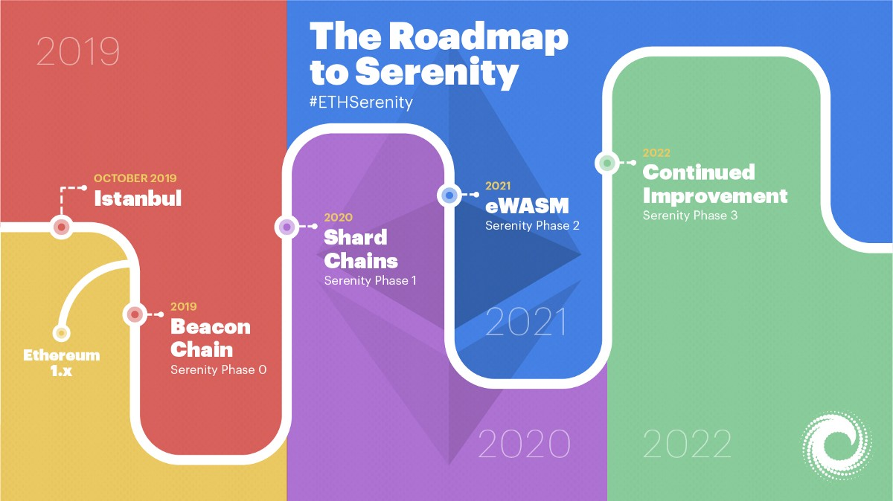

# 路线图

时至今日当我们鸟瞰区块链技术的发展，它仍旧算得上是一个新事物。尽管有关区块链的基础核心概念（例如密码学、去中心化及点对点网络和交易）的研究已经进行了数十年，但可以说是直到2008年比特币的滥觞，这些零散的概念才被整合起来创造出了一个功能性产品。

直到2015年，以太坊逐渐走入人们的视线。至此，以太坊区块链得以成型并且实际可用。尽管计划内升级的日期和细节发生了变化，但以太坊仍坚持不断对协议进行升级，以确保提高其可用性、安全性、功能性和去中心化。

在今年2月的君士坦丁堡升级完成之后，以太坊目前正处于Serenity阶段的风口浪尖，Serenity升级需要通过一系列更新方能达成。然而，居安当思归来源，我们不能忘记自己从哪里来，如此方知来者之可追。以下时间线着眼于以太坊计划内（或计划外）的硬分叉和升级历史，为其下一阶段的升级做好准备。

## **奥林匹克 2015/5/9**

以太坊区块链于2015年7月正式向用户开放使用。以太坊在此之前开放了九个版本的开放测试网络以进行概念证明，其中最后一个版本便是奥林匹克，供开发人员提前探索以太网区块链开放以后的运作方式。Vitalik曾宣布向耗费时间精力对以太坊网络进行压力测试的开发人员提供总额为25,000 ETH的奖励。测试要求很明确：尝试使网络过载，并对网络状态进行极限测试，以便深入了解协议如何处理流量巨大的情况。开发人员需要对四个方面进行测试：交易活动、虚拟机使用、挖矿方式和惩罚机制。

## **边疆 2015/7/30**

经过几个月的压力测试，以太坊网络已准备好发布官方公共主网。7月20日，以太坊的创世区块产生，社区开始逐渐壮大。在Frontier发布前几个月，Vinay Gupta发表了关于以太坊开发过程的说明。该说明的大部分内容虽然十分令人振奋，但同时也发出了对潜在用户的警示。Gupta表示，Frontier是“处于最初始形态”的以太坊版本，开发者应该谨慎行事。Frontier发布前几天，Stephen Taul对开发者作出了与Gupta类似的提醒：“目前的开发者就如同美国边疆扩张时期的拓荒者一般，他们和自己的同伴在开辟新家园时将获得无穷的机会，但同时也将面临许多危险。”

**“边疆”协议包含了以下一系列关键特征：**

* **区块奖励：**在以太坊区块链上，当矿工成功挖掘出一个新区块并使其存在得到确认之后，他们会得到ETH形式的奖励。在此阶段，奖励被定为每个新区快5个ETH。
* **Gas：**在“边疆”诞生之初，每个区块的gas上限被硬编码为5000。这个数量基本上意味着以太坊网络不支持进一步开发。此阶段Gas上限的制定旨在为矿工提供一段缓冲时间，以帮助他们在以太坊网络上的操作走上正轨，同时使得早期开发者安装他们的客户端。几天之后，gas上限被自动移除，以太坊网络能按预期处理交易和智能合约。
* **金丝雀合约：**金丝雀合约被引入“边疆”的目的是提醒用户存在不正当或易受攻击的某条链。它给出的数值只能是0或1。有问题的合约会被赋值为1，因此客户端就能进行识别，避免在无效链上进行挖矿。金丝雀合约的重要意义在于它使得以太坊核心开发团队能够及时制止网络中出现错误的操作或交易。在以太坊发展初期，金丝雀合约虽然显得十分中心化，但却是不可或缺的保护机制。
* **可用性：**所有开发人员的操作都是经由命令行实现，因为完全不存在图形用户界面。虽然可以在以太坊网络中进行操作，但是其用户界面还十分粗糙，它的使用者也在很大程度上局限于具有以太坊背景知识和经验的专业人士。

## **家园 2016/3/14**

“家园”是以太坊网络的首次硬分叉计划，于2016年3月14日发生在第1,150,000个区块上。总的来说，“家园”版本主要为以太坊带来了三大主要更新。第一，取消了金丝雀合约功能，去除了网络中的中心化成分。第二，在以太坊编程语言Solidity中引入了新代码。第三，上线Mist钱包，使用户能够持有或交易ETH、编写或部署智能合约。

“家园”升级是最早的以太坊改进提案（EIP）实施案例之一。EIPs是面向社区提出的改进建议，一旦获得批准，则会囊括在网络升级中。

**“家园”升级主要包括三个EIPs**

**EIP-2：“家园”阶段主要更新** 

EIP 2.1：通过交易创建智能合约的成本被提高至21,000至53,000个gas。通过一个合约创建另一个合约（首选方式）的成本高于通过交易创建合约。通过提高以交易形式创建智能合约的成本，EIP2.1鼓励用户转向以合约创建合约的方式。

EIP 2.2：“s值大于secp256k1n/2的所有交易签名均视为无效。ECDSA恢复预编译合同保持不变并保持接收高s值；这个功能在某些情境下将发挥作用，例如某合同恢复旧的比特币签名。”

EIP 2.3：当合约创建过程中没有足够的gas用以完成操作，该合约将“作废”而非创建一个空白合约。之前的交易可能输出结果包括\[成功\] \[失败\]或者\[空白\]，这一改进则删除了\[空白\]结果。

EIP 2.4：取消用户挖掘稍高难度区块的激励，即增加可挖掘的区块。此升级将新区快产生的时间稳定在每10-20秒之间，并将网络恢复至每块约15秒的总目标时间。

**EIP-7**

“在0xf4添加一个新的操作码，DELEGATECALL，它与CALLCODE的理念类似，不同之处在于前者将发送方和发送值从父范围扩散到子范围，即创建的调用与原始调用具有相同的发送方和发送值。”

**EIP-8：面向未来升级**

EIP-8是一项着眼于未来网络升级计划的改进提案。这一改进旨在确保以太坊上的所有客户端软件都能适应未来的网络协议更新。

## **DAO分叉 2016/7/20**

在以太坊计划内的升级和硬分叉历史中，计划外的DAO事件值得记录。2016年，一个名为The DAO的去中心化自治组织通过发售通证募集了1.5亿美元的资金。同年6月，the DAO遭到黑客入侵，价值5千万美元的ETH被一未知黑客窃取。以太坊社区的大部分成员决定实行硬分叉，将资金返还到原钱包并修复漏洞。然而，这次硬分叉却引来了争议，以太坊社区的小部分成员选择继续在原链上进行挖矿和交易。未返还被盗资金的原链则演变成了以太坊经典（ETC），久而久之受到削弱的原链成为了容易被侵入的对象。而大多数社区成员和核心开发人员选择了分叉链（被盗资金返还至原持有者），这就是我们现在所知的以太坊区块链。

## **大都会 2017-2018**

### **拜占庭硬分叉**

**2017/10/16**

以太坊路线图的下一阶段被称为“大都会”，它将分两个阶段进行：拜占庭和君士坦丁堡。拜占庭将于2017年在第4,370,000个区块上激活。

**其中包括9个EIPs：**

**EIP 100**

调整公式以评估将叔块考虑在内的区块难度。新公式为保证了区块产生速度的稳定性，确保无法通过操纵叔块来强制增加区块高度。

**EIP 658**

对于拜占庭硬分叉升级后的区块，交易收据包括了一个状态字段，用于表示成功（由1表示）或失败（由0表示）。

**EIP 649**

“难度炸弹”\(Difficulty Bomb\)是这样一种机制：一旦被激活，将增加挖掘新区块所耗费的成本（即“难度”），直到难度系数变为不可能或者没有新区块等待挖掘。此时，以太坊网络将处于“冻结”状态。“难度炸弹”机制最初于2015年9月被引入以太坊网络。它的目的是为以太坊最终从工作量证明\(PoW\)转向权益证明\(PoS\)提供支持。从理论上来说，未来在PoS机制下，矿工仍然可以选择在旧的PoW链上作业，而这种行为将导致社区分裂，从而形成两条独立的链：PoS链由验证人\(stakers\)维护，PoW条则由矿工维护。为了预防这种情况的发生，“难度炸弹”机制应运而生。通过增加难度，它将最终淘汰PoW挖矿，并催使网络完全过渡到PoS机制，并且在这个过程中避免了产生具有争议的硬分叉。在此建议中，也被称作“冰河时期”的“难度炸弹”时期将延迟一年，并且区块奖励从5 ETH减少到3 ETH。

了解其他拜占庭硬分叉EIPs可前往Github。

### **君士坦丁堡硬分叉**

 **2019/2/28**

“大都会”升级的第二阶段被称作“君士坦丁堡”，计划于2019年1月中旬在第7,080,000个区块上执行。1月15日，一家名为ChainSecurity的独立安全审计公司发布了一份报告，该报告指出五大主要系统升级其中之一可能会使攻击者有机可乘，以窃取资金。针对该报告，以太坊核心开发者和社区其他成员投票决定推迟升级，直到该安全漏洞得以修复。当月末，以太坊核心开发者宣布升级将于第7,280,000个区块上进行。2月28日，区块高度达到7,280,000，君士坦丁堡硬分叉升级如期执行。目前的以太坊网络处于君士坦丁堡阶段。

**其中主要的EIPs包括：**

**EIP 145：按位移动指令**

在以太坊虚拟机\(EVM\)上增加按位移动指令。这个指令允许二进制信息左右移动。这个改进意味着智能合约的变更执行将便宜10倍。

**EIP 1052：智能合约验证**

允许智能合约只需通过检查另一个智能合约的哈希值来验证彼此。在君士坦丁堡升级之前，智能合约必须提取另一个合约的整个代码才能进行验证，而这样的验证方式需要花费大量时间和精力。

**EIP 1014：智能合约函数CREATE2**

将状态信道引入以太坊网络，促进基于“链下”\(off-chain\)交易的以太坊扩容解决方案。

**EIP 1283：SSTORE操作码**

减少SStore操作码的GAS耗费。这使得交易中多个更新操作的价格更加友好。

**EIP 1234：区块奖励&难度炸弹**

此改进提案包含两大内容：减少区块奖励和延迟难度炸弹。

> **减少区块奖励：**
>
> 将区块采矿奖励从每块3 ETH减少到2 ETH。这个改变也被称作“Thirdening”，即以太坊第三次区块奖励减半。
>
> **推迟“难度炸弹”：**
>
> EIP 1234将“难度炸弹”时期推迟12个月，届时将会进行再次投票。

## **“宁静”\(Serenity\) 2019-2022**

#### **来者可期：Serenity来临**

放眼未来，“宁静”\(Serenity\)是以太坊区块链的终极目的地，但在这之前还将经历伊斯坦布尔硬分叉和“以太坊1.x”阶段。伊斯坦布尔硬分叉将主要由围绕着ProgPoW \(Programmatic Proof-of-Work\)共识算法展开。“宁静”\(Serenity\)的主要内容包括从工作量证明\(PoW\)到权益证明\(PoS\)的完全转变，同时也将完成其他重要的升级：引入信标链\(beacon chain\)、分片\(sharding\)概念；以及用eWASM \(Ethereum-flavored Web Assembly\)替代以太坊虚拟机\(EVM\)。Serenity的所有升级都将分阶段实现，在此期间，以太坊1.x也将持续得到完善，以确保原始PoW链的延续。

以太坊的发展路线一直以来都持续针对核心协议进行更新升级。以太坊于今年二月完成了君士坦丁堡升级，不久后又将迎来伊斯坦布尔硬分叉。这意味以太坊社区距Serenity将更近一步。

Serenity作为以太坊升级的最后一次迭代，其重要性不言自明。2018年，Vitalik在Devcon上详细阐释了Serenity将分成多个阶段进行，并且每个阶段预计间隔一年。

以太坊2.0，也就是大家所熟知的Serenity阶段，秉承着五个设计原则：简洁性、强韧性、持久性、安全性、去中心化。之所以要采用循序渐进的方式实现Serenity，是为了实现以上所有原则，从而进一步将以太坊打造成区块链解决方案的市场领军者。

### **准备阶段：伊斯坦布尔硬分叉**

在正式开启Serenity之前，以太坊需要执行伊斯坦布尔硬分叉，这是继今年2月君士坦丁堡升级后的最后一次计划内硬分叉。此次伊斯坦布尔硬分叉预期将于2019年10月进行，该分叉目前包含11个EIPs，其中之一就是EIP 1057 \[ProgPoW\]。

ProgPoW\(Programmatic Proof-of-Work\)的相关讨论已经在以太坊社区中持续了一段时间。此EIP建议将协议中的挖矿算法切换为ProgPoW，由于ASIC挖矿效率明显优于GPU，该算法旨在削弱ASIC的挖矿优势。

ASIC（专用集成电路）和GPU（图形处理器，即显卡）都是可用于加密货币挖矿的硬件设备。ASIC是高度专业化的硬件，使用ASIC通常可以更高效地进行挖矿作业，从而产生更可观的收益。然而，ASIC的专用性极高，这就意味着用来进行比特币挖矿的ASIC适用于比特币区块链，而进行以太币挖矿的ASIC仅适用于以太坊区块链。虽然效率较高，但ASIC的成本高昂且难以获取，如此一来就可能会导致中心化风险：矿池将被掌控在有能力获取ASIC的矿工手上（这也是长期争论不休的话题）。相比之下，GPU作为通用计算工具也可用于解决许多用例的复杂运算。较之ASIC，GPU可用来对任何加密货币进行挖矿，并且易于获得，使用广泛。然而，也因为GPU不具有类似ASIC的专用算力，其效率和收益远低于ASIC。

一旦EIP 1057被通过，使用抗ASIC的ProgPoW算法将使得ASIC和GPU在进行ETH挖矿时具有同等效率，从而确保了网络的去中心化（此说法仍然具有争议）。总的来看，以太坊的核心开发者似乎都是ProgPoW的拥趸，但他们在作出最终决策前已经启用了针对该算法的第三方审计措施。

####  

### 阶段0：信标链 __2019

预计在2019年，Serenity第一阶段将推出信标链\(Beacon Chain\)。信标链是基于权益证明\(Proof of Stake\)的区块链，信标链的部署将标志工作量证明\(PoW\)到权益证明\(PoS\)共识机制的转变。为了确保链的连续性不被破坏，信标链确立之后将与原始的以太坊PoW链并行。信标链的最初形态囊括了三个主要职责：

* **管理权益证明\(PoS\)共识机制：**PoS是这样一种共识机制：通过网络质押ETH而非耗费精力挖矿来最终确认新区块的产生。
* **处理区块的交叉联结：**使得区块交叉联结是信标链能够确定和维护分片链状态的主要方式。分片链将于阶段1进行部署，所以此更新是在为阶段1做准备。
* **引导达成共识和最终确定性：**信标链通过PoS和Casper FFG共识机制达成最终确定性。PoS规定，2/3的验证者必须在下一个行将产生的区块中质押ETH，这意味着对于潜在的恶意用户来说，施行不正当行为需要承担的经济风险非常之高。

### **阶段1：分片 2020年**

分片链是以太坊网络未来可扩容性的核心特征。从整体概念来看，分片是指：将某数据库（去中心化数据库或其他类型数据库）中许多节点的数据处理职责分割开，允许同时进行交易、存储和信息处理。分片理念与目前的以太坊主链模式完全不同，后者则需要每个全节点对每一笔交易进行处理和验证。

Serenity阶段1将在分片链上处理最终确定性和共识。此阶段的分片链更倾向于“测试运行”，而不是可以立即解决扩容问题的方案。信标链将对分片链的执行情况进行监督。验证者质押32个ETH之后将被随机分配到特定的分片链上进行验证工作（此处的随机性可以确保验证者的分配路径是不可预测的，否则将面临人为操纵的风险）。根据以太坊2.0规范，信标链将支持1024个分片链，每条分片链上将有128个节点进行验证工作。

### **阶段2：eWASM 2020或2021年**

在阶段2中，以太坊2.0升级中的重要功能将被聚合起来。随着新虚拟机eWASM \(Ethereum-flavored Web Assembly\)的引入，分片链将从相当基本的数据标记形态演变为功能完整的交易链，从而担当起以太坊网络扩容的重任。

为了维护区块链生态系统的正常运行，节点必须在虚拟机中执行交易和智能合约。以太坊1.0的虚拟机被称为EVM \(以太坊虚拟机\)。切换到以太坊2.0和信标链后，以太坊网络的虚拟机将升级为eWASM，这是一个基于Web Assembly的虚拟机，由万维网联盟（W3C）定义为开源标准。由于WASM支持多种编码语言，eWASM使得由任何语言编写的智能合约都能在以太坊上运行，而现有的EVM只允许由Solidity语言编写的智能合约。

### “以太坊1.x”

我们需要注意的是，在上文提到的**Serenity阶段0-2中，原有的以太坊PoW链并不会消失。**它将继续得到维护并且与信标链并行，原始PoW链上的矿工仍然能通过传统的挖矿方式获得ETH奖励。随着生态系统逐渐转移到信标链，PoW链可能面临淘汰（有人提议永远保留PoW链），前提是“难度炸弹”机制使得PoW运算的难度系数几近于不可能。

在信标链测试和概念验证期间，原有的以太坊1.0链没有止步不前，而是不断进行完善。这一系列升级和硬分叉就被称作“以太坊1.x”，旨在使当前的以太坊主链持续迭代，以满足信标链部署期间生态系统的需求和应用。

以太坊1.x背后的团队仍处于路线图规划的早期阶段，但他们已经确立了以太坊1.x升级的三个总目标：

1. 通过提高tx / s吞吐量促进主网扩容（优化客户端将大大提高每个区块的gas上限）
2. 收取“状态费用”以限制磁盘空间使用量，从而可以持续运行全节点
3. 升级虚拟机以改善开发人员体验。虚拟机升级包括eWASM和交易模式的改变，新交易模式可以使整体交易费用更加稳定。
4. 开发最终确定性工具，利用信标链对以太坊x中的区块进行最终确定，从而连接以太坊1.0和2.0版本。

跟进以太坊1.x的升级更新及其团队动向可以前往：  
https://docs.ethhub.io/ethereum-roadmap/ethereum-1.x/  
https://en.ethereum.wiki/eth1

### 阶段3：后续升级 \| 2022

阶段2之后，以太坊的发展时间线就没那么明晰了。这也是情理之中的事，因为区块链技术的发展日新月异，开发人员需要继续致力于解决问题、改进协议才能满足不断增长的需求。仍处于讨论阶段的后续升级包括：轻客户端状态协议、主链安全性耦合以及超二次或指数性分片。若以太坊2.0进展顺利，以太坊也将顺势循次而进，届时“以太坊3.0”或将成为下一片新大陆。

\_\_

\_\_

\_\_

_原文链接：_[_https://media.consensys.net/a-short-history-of-ethereum-a8fdc5b4362c_](https://media.consensys.net/a-short-history-of-ethereum-a8fdc5b4362c)\_\_

\_\_

