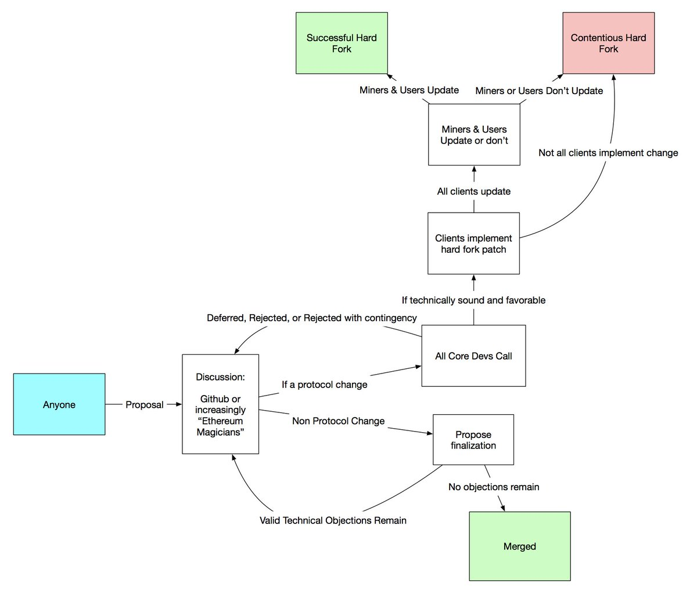

# 关于治理

区块链是一种分布式系统，本质上是共识协议，这意味着网络中的不同节点（例如网络中的计算机）必须运行兼容的软件。

**“节点运行者”**是运行协议的节点所有者和管理者。多数节点运营者都不想运行太多代码工作，其实对任何人来说，即使有了代码规范，要独立编写共识协议的兼容实现都是一项技术挑战。因此，节点运行者便依靠软件库（通常托管在Microsoft / Github服务器上）提供他们可以选择运行的软件。

区块链中的**“核心开发者”**是指从事开发工作从而实现协议的软件开发者。开发者的工作是确保软件的质量，并且通常会对软件库进行维护。

## 治理体系的关键组成部分

### **1. 激励机制**

系统中的每个部分都有特定的激励机制。其激励机制并不总是与系统中的所有其他部分保持完全一致，并且会作出有利于自身生存发展的改变，包括奖励结构、货币政策或权利平衡等方面的变动。

### **2. 协调机制**

由于所有团队不太可能始终都保持完全一致的激励机制，因此团队间针对其相同的激励机制进行协调的能力至关重要。假如一个团队的协调能力相比另一个团队更强，则会出现权利失衡的情况。

实际上，还有一个主要的因素是链上与链下的协调程度，而链上方式更有利于协调。在一些比较新的区块链项目中（例如Tezos或Polkadot），链上协调允许规则甚至是账本历史本身进行改动。

## 线上治理

本着中本聪在原始论文中提出的“去中心化”精神，比特币和以太坊的当前治理系统是非正式的。开发者针对区块链更改提出改进建议，一个主要由开发者组成的核心团队负责协调利益相关方并达成共识。利益相关者包括矿工（节点运行者）、开发者（对核心区块链算法负责）和用户（各种代币的使用者和投资者）。

#### 什么是链上治理？ 

链上治理系统用于对区块链进行管理和改动。在链上治理中，用于发起改动的规则被编码到区块链协议中。开发者则通过更新代码来提出更改请求，每个节点有权参加投票决定接受或拒绝该更改。

#### 链上治理如何运作？ 

非正式治理系统借助线下协调和在线代码修改相结合的方式来实现区块链更改，与此不同的是，链上治理系统只能采取线上方式。通过更新代码提出对区块链的修改请求，随后节点可以投票接受或拒绝。并非所有节点都享有同等的投票权，投票权重主要由节点的代币持有量决定。

一旦修改请求被通过，则会被包含进区块链中并成为基准。在一些线上治理的实现案例中，如果建议的修改未成功实施，那么更新后的代码可能会回滚到之前的版本。

#### 优点 

* 去中心化的治理方式
* 缩短改动过程周期
* 极大降低硬分叉可能性

#### 缺点 

* 投票率低
* 投票可能被操纵（质押金额较大的节点）

## 线下治理

#### 什么是线下治理？ 

链下治理在形式和具体实施方式上与现实世界的政治模式高度相似。各个利益方试图通过一系列协调博弈行为来争取对网络的控制权，并说服他人支持己方。他们的特定行为并不受代码约束，而是根据其他利益相关者的已知偏好，做出有利于自己的决策。区块链技术和博弈论的互相交织是有一定原因的。

#### 线下治理如何运作？

开发者提交区块链的改进建议，一个主要由开发者组成的核心团队负责协调利益相关方并达成共识。利益相关者包括矿工（节点运行者）、开发者（对区块链核心算法负责）和用户（各种代币的投资者和使用者）。

各个利益相关方通过私人和社区方式对改进建议表示同意与否。然后核心开发者需要了解节点运行者和矿工是否同意升级其软件。理想情况是，各方达成一致并且代码更改也顺利进行。一切相关事宜都会提前公布，以便各利益相关方有时间进行更新。

在意见产生分歧时，利益相关方有两种选择：尝试说服其他利益相关方采取有利于己方的态度；如果无法达成共识，他们有能力对协议发起硬分叉，并保留其认为必要的功能。由此，两条链会形成竞争关系，以夺取用户、开发者和算力。

## 相关资源

* [EIPs](https://github.com/ethereum/eips): Ethereum Improvement Proposals 以太坊改进提议
* [Ethereum Magicians](https://ethereum-magicians.org/): 技术治理社区
* [以太坊治理的Gitter聊天室](https://gitter.im/ethereum/governance)
* [ethereum/pm](https://github.com/ethereum/pm): 核心开发者会议
* [EIP-0](https://twitter.com/hashtag/EIP0?src=hash): 治理的哲学理念和伦理规范。（[核心开发者视频](https://www.youtube.com/watch?v=VJ3r52T7HV8)+[AMA视频](https://www.youtube.com/watch?v=LcBqypKbYMA)+[视频集合及评论](https://www.reddit.com/r/ethereum/comments/8ggrgo/join_the_ethereum_governance_ama_at_the_eip0/)）
* [精通以太坊的“治理”章节](https://github.com/lrettig/ethereumbook/blob/governance/contrib/governance.asciidoc)
* [Vlad Zamfir对治理的看法](https://ethereum-magicians.org/t/vlad-zamfirs-ethcc-talk-about-governance/78)
* [区块链治理总览](https://blog.goodaudience.com/blockchain-governance-101-eea5201d7992) \(Vlad Zamfir\)

