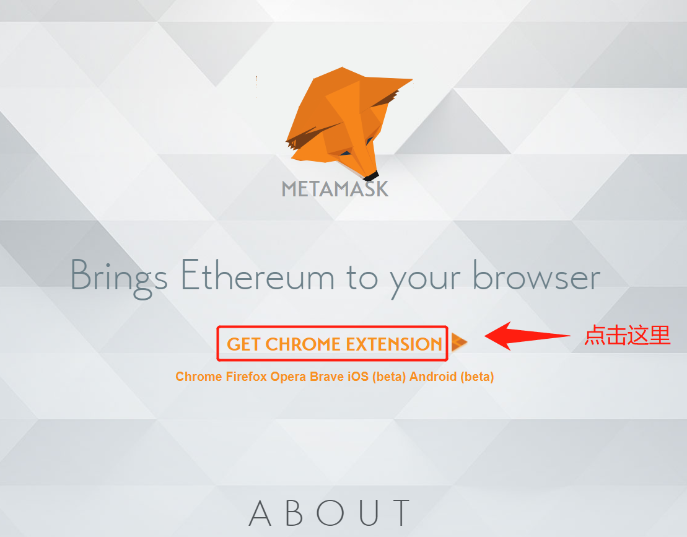

# 新用户入手

## Buy ETH 购买以太币


与以太坊网络交互的前提是，你拥有以太币\(ETH\)。获得ETH最简单的方法就是[在Coinbase交易所上购买](https://www.coinbase.com/price/ethereum?r=conner_k3)。

注意！！你不需要买完整的一个ETH。ETH可以被整除到小数点后十八位，所以你可以买零点几个ETH。

## 安装MetaMask

有了ETH，现在你想要将它发送到你选择的钱包里存储起来，并在网络上使用。钱包为你创建帐户，账户是随机生成的42字符地址，以0x开头。有了帐户，你就能存储ETH并且通过生成以太坊网络上的交易来使用它。

我们建议你先将ETH转移到MetaMask钱包。MetaMask是一个浏览器扩展程序，安装了它，你就可以在Chrome、Brave、Firefox或Opera浏览器中使用以太坊Dapps。

MetaMask安装完了，现在你有了属于自己的钱包地址\(0x……\)。你可以去Coinbase交易所，把你获得的ETH发送到你的新钱包地址。大概一分钟后，你会就看到ETH出现在你的MetaMask钱包里。

## 
安装移动钱包（可选）

每个以太坊帐户都可以通过一个随机的字串恢复，这些字串被称为种子密语，安装MetaMsak的时候会出现。可以在多个不同的钱包（包括移动钱包）中使用相同的帐户。

我们建议下载[Coinbase钱包](https://wallet.coinbase.com/)，点击恢复并键入你的种子密语。这样，你的钱包就可以移动啦！

## 尝试使用以太坊应用程序

现在你自己的电子钱包里已经有ETH，你可以使用任何基于以太坊的应用程序（有时被称为dapps），超级厉害的！！

有许多不同类型的应用程序构建在以太坊上，但在开始使用前，请你看看这里的一些建议:

#### 去中心化金融

[Compound](https://compound.finance/)：借出和借入ETH或其他通证。

Uniswap：能轻易地用ETH交换其他通证。

#### 游戏

[CryptoKitties](https://www.cryptokitties.co/)：收集和养育数字猫。

[Gods Unchained](https://godsunchained.com/)：建立在以太坊上的免费数字交易纸牌游戏。

#### 收藏品

[OpenSea](https://opensea.io/)：购买、出售和发现稀有的数字产品。

[Origin Protocol](https://www.originprotocol.com/en)：区块链上的去中心化市场。

#### 其他

[ENS](https://app.ens.domains/)：购买一个ENS名，让你的地址更具有人类可读性\(myetheraddress.eth\)。

PoolTogether：买无损失彩票，有机会中奖，不中奖也能拿回买彩票的钱。

## 长期存储

随着不断混迹于以太坊，你可能会获得更多的ETH和其他代币。强烈建议在硬件钱包和智能合同钱包等中存储数量较多的加密货币，这比基本帐户钱包更安全。

硬件钱包是在线访问你的资金最安全的方法。因为签署交易时，硬件钱包不会公开你的私钥到互联网上。

智能合约钱包是具有独特强大功能的钱包。它们为用户提供了额外的安全性和恢复功能。

