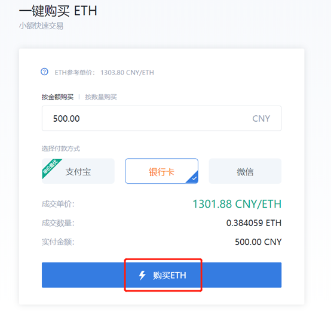

# 运行以太坊节点

## 概述

任何人都可以在自己的计算机上运行以太坊节点。这意味着你可以参与验证以太坊区块链上的交易和区块。两个最常见的节点客户端是Geth和Parity。由于节点运行的类型和系统的硬件规范不同，初始同步时间和存储需求也各不相同。有关当前全节点的区块数据和状态存储大小的信息，请查阅：[https://etherscan.io/chartsync/chaindefault](https://etherscan.io/chartsync/chaindefault)

下面是用户可以运行的不同类型的节点、客户端的安装设置及其介绍。

## 全节点

全节点的功能：

😃 将所有区块链数据存储在磁盘上，可以根据请求为网络提供任何数据。

😃 对区块进行验证时接收新交易和新区块。

😃 验证所有区块和状态。

😃 为了初始同步更为高效，全节点会存储最近的状态。

😃 整个区块链的所有状态都可以从全节点导出。

😃 一旦完全同步，全节点就会存储所有状态，类似于存档节点（更多信息参见下文）。

### Client settings客户端安装

#### geth——快速同步模式

快速同步模式是geth默认的同步模式。通过下载整个状态数据库可以快速同步全节点。首先是请求同步区块头，然后加入区块体和收据，从而对整个节点进行同步。快速同步模式开启后直到以太坊网络的最终有效区块也被同步，就切换到全同步模式。

#### geth——全同步模式

从创世区块开始同步全节点，验证所有区块并执行所有交易。这种模式比快速同步模式稍微慢一点，但是安全性有所提高。

#### parity——warp同步模式

warp同步模式是parity默认的同步模式。通过下载记录了第30,000个最终有效区块和最新状态数据库的快照，使用warp同步模式对以太坊全节点进行同步。

数据经由快照恢复后，客户端切换到全同步模式，并在后台同步网络中的旧区块。

在完成同步后，parity默认节点将作为全节点服务于网络。

#### parity——非warp模式

从创世区块开始同步全节点，验证所有区块并执行所有交易。这种模式比warp同步模式稍微慢一点，但是安全性有所提高。

采用geth完全同步模式和parity非warp模式进行同步的节点都被认为是一个以太坊全节点，因为:

🧐 节点从创世区块开始同步完整区块链数据。

🧐 节点重放所有交易并执行所有合约。

🧐 节点为每个区块重新计算状态。

🧐 节点将所有的历史区块存储在磁盘上。

🧐 节点将最新的状态存储在磁盘上，并修剪旧状态记录。

## 轻节点

轻节点的功能：

🤪 存储区块头链并按需请求所有其他信息内容。

🤪 可以通过检验区块头的状态根，从而验证数据的有效性。

轻节点适用于低容量设备，比如嵌入式设备或移动电话，这些设备无法存储几十GB的区块链数据。

### 客户端安装

#### geth——轻同步模式

等待大约200秒后，从第2300个区块开始同步，然后定期接收到含有1到10个区块的区块包。初始同步只需要很短时间。

#### parity——轻同步模式

立即从一个硬编码值（区块高度6219777）开始同步，速度大约为每分钟23,500个区块，同步区块高度达到6,500,000，过程需要15分钟。一旦同步，当新区块被挖出并经由全节点验证，轻节点就会接收到这些区块。

#### parity——非硬编码轻同步模式

除了从创世区块开始同步以外，其他设定与轻同步模式一样。

### 连接Parity 轻节点到MetaMask（MacOS操作系统）

步骤如下：

1.下载自制程序\(homebrew\)（必须先通过苹果的开发条款）。

2. 查找和打开应用终端（应用/终端）。

3. 在终端中依次输入以下命令：

**brew tap paritytech/paritytech** （把parity添加到brew tap列表）

**brew install parity** （安装parity稳定版本）

**parity --light --jsonrpc-cors="chrome-extension://nkbihfbeogaeaoehlefnkodbefgpgknn" &** （同步轻节点，与其他节点相互连接，下载区块头信息）

按ctrl+C，然后键入：

**tail -f nohup.out** （将给你展示日记，以确保所有工作得到切实履行）

1.在网页浏览器上打开Metamask，断开网络，连接到本地主机。

## 存档节点

存档节点的功能：

😛 存储所有全节点保存的内容。

😛 也创建了历史状态的档案。

若你想要检查任何给定区块高度的帐户状态，只能查询存档节点。例如，如果你想知道一个账户在区块高度4,000,000时的以太币余额，你就要运行并查询一个存档节点。

像Infura这样的基础设施，它作为存档节点通常只提供服务。存档节点依赖于用例，对区块链的安全性或信任模型没有影响。

### 客户端安装

#### geth——轻同步模式——存档模式

从创世区块开始同步存档节点，充分验证所有区块，执行所有交易，并将所有中间状态写入磁盘（“存档”）。

在Geth客户端中，这称为gcmode模式，指的是“无用单元回收”\(garbage collection\)的概念。把区块与交易存档基本上就等于把它们封存起来。

#### parity——非warp模式——修剪存档模式

从创世区块开始同步存档节点，充分验证所有区块，执行所有交易，并将所有中间状态写入磁盘（“存档”）。

在Parity客户端中，“修剪”（Pruning）指状态树修剪。把区块与交易存档基本上就等于把它们封存起来。

## 软件

一般消费者级别的笔记本电脑性能足以运行全节点，但不能运行存档节点。运行存档节点需要2+ TB的磁盘空间，不能使用硬盘作为磁盘，必须使用能运行完整节点和存档节点的固态硬盘。轻节点在SD卡和硬盘上运行情况良好。

如果全节点离线一段时间，数据可能会损坏，需要一段时间才能恢复。若要运行自己的节点，请保持设备持续开机并且联网，从而最大化可靠性，最小化停机时间，获得最佳效果。这在笔记本电脑上是不可能实现的，而使用台式电脑\(500W+\)则价格昂贵，所以最好选择一种在制造和替换成本低廉，且最好可以免费运行的设备。树莓派的性能足以运行轻节点，而在ARM微型计算机上全节点才能运行良好。可以在Block And Mortar、Ava.do与DAppNode上查看预同步的预制设备。

警告：永远不要把任何无法彻底检查和验证的数据接入自己的局域网，否则可能会在不知情的情况下遭到DNS劫持或密码劫持。如果硬件和软件不是开源的（至少汇编软件不是开源的），那么就无法确保其安全。

## 其他资源

🤓 感谢Afri Schoedon，这篇介绍文章来源于其博客中的[这篇文章](https://dev.to/5chdn/the-ethereum-blockchain-size-will-not-exceed-1tb-anytime-soon-58a)。

🤓 [驱散有关以太坊磁盘空间的不实之论](https://www.tokendaily.co/blog/dispelling-myths-about-ethereum-s-disk-space)

## 以太坊客户端安装教程

### Geth客户端安装教程

#### Windows安装

访问官网下载地址[https://geth.ethereum.org/downloads/](https://geth.ethereum.org/downloads/)，点击“Release”栏下版本，下载exe的安装程序即可，简单方便快捷。

#### 

#### Linux安装

Ubunt是日常常见的Linux系统，以其为例，安装Geth客户端需要执行以下命令：

**sudo apt-get install software-properties-common**

**sudo add-apt-repository -y ppa:ethereum/ethereum**

**sudo apt-get update**

**sudo apt-get install ethereum**

#### 

#### Mac OS安装

先安装Mac系统上的软件管理神器brew，执行下面的命令即可安装：

/usr/bin/ruby -e "$\(curl -fsSL https://raw.githubusercontent.com/Homebrew/install/master/install\)"

已经安装brew的话，可直接打开terminal 命令行工具，执行下面的命令：

**brew tap ethereum/ethereum**

**brew install ethereum**

### Parity客户端安装教程

Parity Ethereum v2.6.4-beta版本github下载地址：[https://github.com/paritytech/parity-ethereum/releases](https://github.com/paritytech/parity-ethereum/releases)

选择相应系统，点击“Binary”一栏下蓝色文字，即可进行下载以太坊Parity最新客户端。

