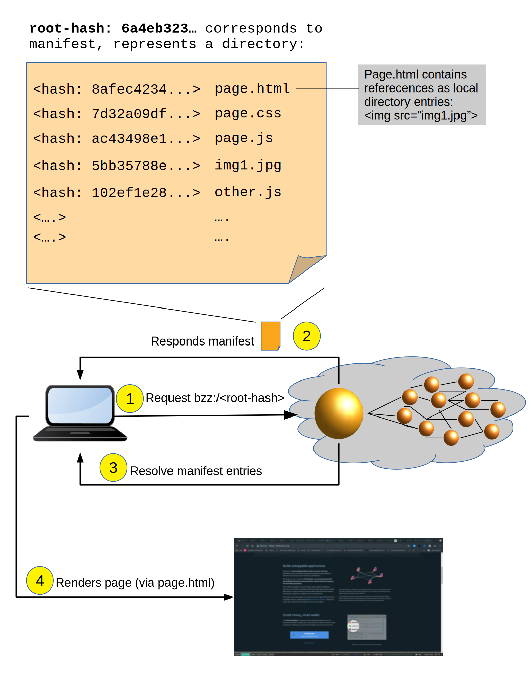

# 架构概述

## 2.1. 前言

Swarm定义了三个关键概念：

**Chunk**：大小有限 \(最大4K\) 的数据块，Swarm中存储和检索的基本单位。网络层只识别chunk，没有文件概念。

**Reference**：文件的唯一标识符，允许客户端检索和访问内容。对于未加密内容，文件reference是数据的加密哈希，并作为其内容地址。该哈希长度为32字节，序列化为64个十六进制字节。如果是加密文件，则包含两个等长的部分：前32个字节是内容地址，后32个字节是解密密钥（共64字节），序列化为128个十六进制字节。

**Manifest**：描述文件集合的数据结构。Manifest指定路径和相应的内容哈希，以允许基于URL的内容检索。[BZZ URL方案](https://swarm-guide.readthedocs.io/en/latest/features/bzz.html#bzz-url-schemes)假定域名中的引用内容是manifest，并呈现路径与请求路径相匹配的内容条目。Manifest也可以映射到文件系统目录树 \(directory tree\)，该目录树允上传和下载目录。最后，manifest也可以被视作是索引，因此它可以用于实现简单的键值存储或数据库索引。这提供了虚拟主机功能 \(virtual hosting\)，可以存储整个目录、web3网站或原始数据结构，类似于web2.0，使集中托管成为可能。

Swarm定义了文件的特定标识符 \(identifier \)。Reference的标识符部分用作内容的检索地址。该地址必须是：

* 无冲突（两个不同的数据块不会映射到同一个标识符）
* 确定的（同样的内容始终对应同样的标识符）
* 均匀分布

Swarm中标识符的选择根据[Swarm Hash](https://swarm-guide.readthedocs.io/en/latest/architecture.html#swarm-hash)中所描述的分层Swarm哈希。以上地址属性允许我们将哈希视作能够找到对应内容的地址。由于哈希要满足“无冲突”特点，所以会被绑定到一个特定版本的内容。因此在很大程度上，哈希寻址是不可篡改的，甚至不能代表变化的内容：“内容更改会引起哈希变动”。

然而网络用户习惯于使用多元资源，查找域名时看到最新版本的“网站”。以太坊域名服务 \(ENS\) 和订阅服务 \(Feed\) 使多元资源成为可能。 ENS是以太坊区块链上的智能合约，域名所有者可以对其域名注册内容。通过使用ENS进行域名解析，URL方案可基于助记符提供内容检索，与万维网DNS相似，不同的是没有服务器。 订阅服务 \(Feed\) 则是一种链下解决方案，用于提供资源更新，与ENS相比更便宜，更新更快，但是愿意付费的第三方可以将更新合并到ENS上。

就像Swarm中的内容使用32字节的哈希值寻址一样，网络中的每个Swarm节点也都与32字节的哈希地址相关联。所有Swarm节点都有自己的基址 \(base address\)，该地址由以太坊帐户公钥的哈希 \(Keccak 256bit SHA3\) 派生而来：

| 注意 |
| :--- |
| Swarm节点地址 = sha3 \(以太坊账户公钥\)，即swarm节点基址。这些节点地址在相同的数据地址空间中进行定位。 |

当在Swarm中上传资源时，内容会被分割为数据块 \(chunks\)。通过由内容派生出的确定地址（chunk哈希），每个chunk都可以被访问。数据块的references被打包到一个chunk中，具有相应的哈希。通过这种方式，内容被映射到默克尔树中。这种分层的Swarm哈希结构允许对一条内容中的chunks进行默克尔证明，从而能够对（大）文件进行完整的随机访问（例如允许在流视频中安全跳过或在数据库文件中查找密钥） 。

Swarm实现了分布式原图像存档 \(distributed preimage archive\)，这实际上是一种特定类型内容寻址的分布式哈希表，其中距离某个chunk地址最近的节点不仅提供有关内容的信息，还对数据进行托管。

两者的可行性取决于以下假设：任何节点（上传者/请求者）都可以“访问”任何其他节点（存储者）。这个假设可以通过特殊的网络拓扑结构 \(kademlia\) 来实现，该拓扑结构可以保证在网络规模中存在对数的最大数量转发跃点。

| 注意 |
| :--- |
| Swarm中不存在删除/移除功能。数据一旦上传，则无法撤回。 |

节点缓存在检索时传递的内容，从而形成自动缩放的弹性云：流行（经常访问）的内容被复制到整个网络中，从而减少检索延迟。缓存还可以最大程度地利用资源，因为节点将传输的数据存储到专用空间。如果达到容量上限，垃圾回收过程将清除访问最少的chunk。结果就是，访问最少的内容最终被删除。存储保险（尚未实施）将为用户提供安全保障，以防止重要内容被清除。

## 2.2. 叠加网络

#### 2.2.1. 对数距离

两个等长字节序列x和y的距离度量 MSB\(x,y\)MSB\(x,y\) 是xXORy（按位异或）的二进制整数转换的值。二进制类型转换为大端字节序：最高有效位在先 \(= MSB\)。

邻近度 \(x,y\) 是MSB距离的离散对数缩放，定义为距离的以2为底的对数的整数部分的倒数。通过对xXORy \(最远为0，最近255，自身为256\) 的 \(MSB\) 二进制表示形式中的共用前导零进行计数来计算。

按相对于固定点x的邻近度顺序将空间中的点（长度为nn的字节序列）分类为bin。每个项目与x的距离最多为前一个bin中项目的x的一半。给定均匀分布项目的样本（任意序列上的哈希函数），邻近度范围映射到基数为负指数范围的一系列子集

它还具有以下特性：属于同一个bin的任何两个地址之间的距离最多为与x的距离的一半。

如果我们将bin中项目的随机样本视为网络中节点的互连，则相对邻近度可以用作图的遍历的本地决策基础，目标是在两点之间找到一条路线。由于在每个跃点上，有限距离减半，只要每个相关的bin都不为空，就可以保证从一个节点到另一个节点所需的跃点数具有恒定的最大限制。

#### 2.2.2. Kademlia拓扑

Swarm使用以太坊devp2p rlpx套件作为底层网络的传输层。这种不常见的变体允许半稳定的节点连接（通过TCP）以及经验证和加密的同步数据流。

我们说一个节点具有kademlia连接性，如果（1）对于每个邻近度，直到（但不包括）某个最大值d（饱和深度），该节点至少与一个节点相连；并且（2）连接了与其自身邻近度大于或等于d的所有节点。

如果已连接子图 \(subgraph\) 的每个点都具有kademlia连接性，那么我们说该子图具有kademlia拓扑。在具有kademlia拓扑的图中（1）存在任何两点之间的路径，（2）只能通过每个跃点上的本地判定找到，并且（3）保证终止深度不超过目标深度加一。

给定一组在空间中均匀分布的点（例如应用于Swarm数据的哈希函数结果），邻近度bins映射到基数为负指数范围的一系列子集，即PO bin 0有任意随机样本的一半点数，PO bin 1有四分之一，PO bin 2有八分之一，依此类推。N节点网络中饱和深度的期望值为log2\(N\)。最后一个bin可以合并所有比深度更深的bin，称为最邻近bin。

Swarm节点由Swarm基本帐户的以太坊地址的哈希标识。这用作它们的覆盖地址，根据这些地址计算邻近度顺序bins。连接到节点的节点定义了另一个实时kademlia表，其中图形边缘表示devp2p rlpx连接。

如果集合中的每个节点都有一个已连接节点的饱和kademlia表，则节点“实时连接”图具有kademlia拓扑。Kademlia图的属性可用于在节点之间通过覆盖寻址路由消息。在转递kademlia网络中，如果存在从发送节点到目标节点的路径（可通过该路径中继消息），那么该消息可路由 \(routable\)。在具有kademlia拓扑的成熟子网中，每条消息都是可路由的。很大一部分节点不稳定在线，将一部分已连接的节点保留在其PO bins中，即使相关节点掉线，每个节点在任何时间点转发消息的几率也增加了。

#### 2.2.3. Bootstrapping及discovery

假定加入去中心化网络的节点缺乏经验，即通过单个已知节点潜在连接。由于这个原因，bootstrapping将需要包括一个discovery组件，借助于该组件，节点之间可以相互交换信息。

协议如下：最初，每个节点的饱和深度为零。节点会随着饱和深度的变化不断通知其连接的节点。当某个节点建立了新连接，如果它和相应节点的接近程度不低于对方告知的饱和深度（即如果它们足够接近），则它可以将此新连接通知给每个节点。通知始终发送给与该新连接共享PO bin的每个节点，包含完整的覆盖地址和底层地址信息。不希望中继消息也不打算建立kademlia的轻节点会被排除。

当节点收到新节点地址的通知时，会将其存储在已知节点的kademlia表中。在收听传入的连接时，还会主动尝试连接到节点以实现饱和：尝试连接到N个最近节点的PO边界内（最近邻点深度）的每个已知节点，并且（2）尝试通过将正常节点填充到bin中以达到最近邻点深度。为了最有效地满足（1），节点会在任何时间尝试连接到最需要的节点。低（远）bins比高（近）bins更重要，因为其容量更大。将一个新节点添加到非空bin，比起将一个节点加入一个空bin更为重要，因为能够更快使kademlia达到饱和。因此，该协议使用自下而上、深度优先的策略来选择要连接的节点。已尝试但无法建立连接的节点将使用指数退避重试（即在每次尝试后时间间隔翻倍）。经过一定次数的尝试后，若仍然失败将不再考虑这些节点。

连接足够数量的节点后，bin达到饱和，bin饱和深度增加。如果节点当前的饱和深度发生变化，节点则将继续向其他节点同胞。随着其饱和深度的增加，节点收到的新节点的通知会越来越少（因为它们已经知道邻近节点）。一旦节点找到了所有最近节点并且素有bins都达到饱和，那么就不会再有新节点通知。因此如果某个节点（在一段时间内）未收到新节点，则该节点可以得出饱和的kademlia状态。该节点不需要知道网络中的节点数量。实际上，在节点停止接收新节点地址之后某时，可以根据深度有效估计网络大小（深度n表示$$2^n$$个节点）。

这样的网络可以轻松应用于转发式消息传递系统。 Swarm的PSS就是基于此。 Swarm还使用此网络来实现其存储解决方案。

## 2.3. 分布式原像存档

分布式哈希表 \(Distributed hash tables, DHT\) 利用覆盖网络来实现分布在节点上的键值存储。基本思想是将键空间映射到覆盖地址空间，并使用地址在键附近的节点查找有关信息。用于去中心化内容寻址存储的DHT通常会将内容指纹与可以提供该内容的节点 \(seeders\) 相关联。然而，我们可以直接使用相同的结构：不是将内容位置信息存储在最近地址（指纹）节点上，而是直接对内容本身进行存储。我们称这种结构为分布式原像存档（Distributed Preimage Archives, DPA）。

DPA会考虑哪些节点存储什么内容，这也意味着一些限制：（1）节点之间的内容负载平衡是必需的，这一点可以通过将内容分割成同等大小的数据块 \(chunking\) 来实现； （2）必须有一个过程使数据块到达应该存储（同步）的位置； （3）由于节点在存储内容上没有发言权，因此应采用推诿 \(plausible deniability\) 进行度量。

该设计中的数据块检索的执行方式是：通过将检索请求从请求节点中继到存储节点，然后将检索到的数据块从存储节点传递回请求节点。

由于Swarm实现了DPA（超过4096字节的数据块），因此将检索请求中继到目标数据块地址等同于将请求传递到存储节点。转发kademlia能够将此类检索请求路由到数据块地址的附近。为了实现传递，我们只需要假设每个节点在转发检索请求时记住请求者。一旦请求到达存储节点，就可以开始传递内容，包括将数据块中继回请求者。

在这种情况下，如果检索请求可路由到最接近数据块地址的存储设备，并且从存储设备路由回请求者节点，则可以为节点检索数据块。检索成功与否取决于（1）查找此类路由策略的可用性以及（2）最近节点（同步）数据块的可用性。请求-传递往返的延迟取决于跃点数量和沿途每个节点的带宽质量。上传后可用性的延迟取决于同步协议的效率。

#### 2.3.1. 反复检索

如果最近节点是唯一的存储节点且退出，则无法检索内容。要应对这种情况，可以通过使一组邻近节点保留最近的每个数据块的副本。如果数据块可检索，并且在任何math：n-1负责节点离线后仍将保留，则将其称作“可反复检索度为math：n的数据块” \(redundantly retrievable of degree math:n\)。如果转发请求失败，可以重试或启动并发检索请求。如果存储节点发生故障，那么这两个后备选项不可用。因此反复检索非常重要。

完全相连的邻近节点区域被视为责任区 \(area of responsibility\)。如果数据块进入节点的责任范围内，则存储节点负责（存储）该数据块。然后，让我们假设：（1）沿稳定节点中继请求的转发策略，以及（2）一种存储策略，即邻近节点区域中（最少R个节点）的每个节点都要存储责任区内的所有数块。只要这些假设成立，即使R-1个存储节点同时离线也可以检索到每个数据块。至于第二点，我们仍需要假设邻近节点区域中的每个节点都能存储每个数据块。

关于反复检索的更多措施（例如[纠删编码](https://en.wikipedia.org/wiki/Erasure_code)）将在未来进行实现。

#### 2.3.2. Caching and purging Storage

Node synchronisation is the protocol that makes sure content ends up where it is queried. Since the Swarm has an address-key based retrieval protocol, content will be twice as likely be requested from a node that is one bit \(one proximity bin\) closer to the content’s address. What a node stores is determined by the access count of chunks: if we reach the capacity limit for storage the oldest unaccessed chunks are removed. On the one hand, this is backed by an incentive system rewarding serving chunks. This directly translates to a motivation, that a content needs to be served with frequency X in order to make storing it profitable. On the one hand , frequency of access directly translates to storage count. On the other hand, it provides a way to combine proximity and popularity to dictate what is stored.

Based on distance alone \(all else being equal, assuming random popularity of chunks\), a node could be expected to store chunks up to a certain proximity radius. However, it is always possible to look for further content that is popular enough to make it worth storing. Given the power law of popularity rank and the uniform distribution of chunks in address space, one can be sure that any node can expand their storage with content where popularity of a stored chunk makes up for their distance.

Given absolute limits on popularity, there might be an actual upper limit on a storage capacity for a single base address that maximises profitablity. In order to efficiently utilise excess capacity, several nodes should be run in parallel.

This storage protocol is designed to result in an autoscaling elastic cloud where a growth in popularity automatically scales. An order of magnitude increase in popularity will result in an order of magnitude more nodes actually caching the chunk resulting in fewer hops to route the chunk, ie., a lower latency retrieval.

#### 2.3.3. 同步

Smart synchronisation is a protocol of distribution which makes sure that these transfers happen. Apart from access count which nodes use to determine which content to delete if capacity limit is reached, chunks also store their first entry index. This is an arbitrary monotonically increasing index, and nodes publish their current top index, so virtually they serve as timestamps of creation. This index helps keeping track what content to synchronise with a peer.

智能同步是一种分发协议，可确保进行这些传输。除了访问计数之外，如果达到容量限制，哪些节点用于确定删除哪些内容，块还存储其第一个条目索引。这是一个任意单调递增的索引，并且节点发布其当前的最高索引，因此实际上它们充当创建的时间戳。该索引有助于跟踪要与对等方同步的内容。

When two nodes connect and they engage in synchronisation, the upstream node offers all the chunks it stores locally in a datastream per proximity order bin. To receive chunks closer to a downstream than to the upstream, downstream peer subscribes to the data stream of the PO bin it belongs to in the upstream node’s kademlia table. If the peer connection is within nearest neighbour depth the downstream node subscribes to all PO streams that constitute the most proximate bin.

当两个节点连接并参与同步时，上游节点将按每个邻近顺序箱将其本地存储的所有块提供给数据流。为了接收更靠近下游而不是上游的数据块，下游对等方订阅了上游节点的kademlia表中它所属的PO bin的数据流。如果对等连接在最近的邻居深度之内，则下游节点订阅构成最接近的bin的所有PO流。

Nodes keep track of when they stored a chunk locally for the first time \(for instance by indexing them by an ever incrementing storage count\). The downstream peer is said to have completed _history syncing_ if it has \(acknowledged\) all the chunks of the upstream peer up from the beginning until the time the session started \(up to the storage count that was the highest at the time the session started\). Some node is said to have completed _session syncing_ with its upstream peer if it has \(acknowledged\) all the chunks of the upstream peer up since the session started.

节点会跟踪它们首次在本地存储块的时间（例如，通过不断增加的存储计数为它们建立索引）。如果下游对等方从开始到会话开始为止一直（确认）上游对等方的所有块（直到会话开始时最高的存储计数），则已完成历史同步。 。如果某个节点自会话开始以来已经（确认）上游对等方的所有块，则据说该节点已完成与其上游对等方的会话同步。

In order to reduce network traffic resulting from receiving chunks from multiple sources, all store requests can go via a confirmation roundtrip. For each peer connection in both directions, the source peer sends an _offeredHashes_ message containing a batch of hashes offered to push to the recipient. Recipient responds with a _wantedHashes_.

为了减少由于从多个来源接收数据块而导致的网络流量，所有存储请求都可以通过确认往返进行。对于双向的每个对等方连接，源对等方都将发送一个offerHashes消息，其中包含一批要推送给接收者的哈希。收件人以一个通缉哈希为响应。

## 2.4. 数据层

与Swarm相关的数据单元有不同的四层：

* _message_: p2p RLPx 网络层，消息与devp2p线路协议相关
* _chunk_: 分布式原像存档中固定大小的数据存储单元 
* _file_: 与mime类型关联的最小单元。这是用户的最小单位语义，基本上是文件系统上的文件
* _collection_: _swarm manifest_代表了文件路径的映射。该层具有到文件系统目录树的映射。给定简单的路由规定，可以以标准化方式将url映射到文件，从而允许manifest模仿站点映射/路由表。因此Swarm可以充当Web服务器（虚拟云托管服务）。

Swarm的实际存储层由两个主要组件组成：localstore和netstore。Localstore由内存中的快速缓存（内存存储）和持续性磁盘存储（dbstore）组成。 NetStore正在将本地存储扩展到Swarm的分布式存储，并实现了分布式原像存档（DPA）。

#### 2.4.1. 文件

FileStore是用于存储和检索文件的本地接口。将文件上传给FileStore进行存储时，它将文档分块为默克尔哈希树，然后将其根密钥发还给调用方。之后可以使用此密钥来检索有问题的文档。

将文件分块到默克尔树中的组件称为chunker。Chunker使用bzzhash算法，该算法是基于任意块哈希的并行树哈希。将chunker置入I / O reader后（可以是文件或网络摄像头流），它可以将数据流分割成固定大小的数据块，使用任意块哈希（在Swarm中是BMT哈希）对数据块进行哈希。如果要进行加密，则在哈希之前就要对数据块进行加密。连续数据块的references被连接起来并打包成中间块 \(intermediate chunk\)，而中间块又再次进行加密和哈希，并打包成下一级中间块。对于未加密的内容和32字节的chunkhash，4K数据块能够在Swarm哈希树中产生128个分支。如果进行了加密，则reference为64字节，在Swarm哈希树中产生64个分支。构造Swarm哈希树的这种递归过程将产生一个根块，该根块的哈希就是文件的Swarm哈希。如果上传内容未加密，则文档的reference 充当Swarm哈希。如果文件加密，则将Swarm哈希与rootchunk的解密密钥串联在一起。

当reference发送给FileStore进行文件检索时会调用Chunker，将可搜索的文档阅读器交还给调用者。从某种意义上说，这是一个“懒惰”的阅读器，因为它仅在读取基础文档时才检索其中一部分（缓冲类似于浏览器中的视频播放器）。给定reference，FileStore将收取Swarm哈希，并使用NetStore检索文档的根块。解密后（若需要的话），将处理下一级块的reference。由于数据偏移可以轻松地映射到中间块的路径，因此可以对文档进行有效的随机访问，并且受最低级别支持。 HTTP API提供范围查询，并且可以将它们转换为低级API的偏移量和跨度，以在不破坏文件的前提下提供随机访问。

Swarm通过[bzz-raw](https://swarm-guide.readthedocs.io/en/latest/features/bzz.html#bzz-raw) URL方案直接在HTTP本地代理服务器上公开FileStore API。该API允许通过POST请求上传文件，以及通过GET请求下载文件。由于在此级别中的文件没有关联的mime类型，出于正确显示或服务应用程序的考虑，可以将`content_type`查询参数添加到url中。这可以在HTTP响应中设置适当的内容类型。

#### 2.4.2. Manifests

The Swarm _manifest_ is a structure that defines a mapping between arbitrary paths and files to handle collections. It also contains metadata associated with the collection and its objects \(files\). Most importantly a manifest entry specifies the media mime type of files so that browsers know how to handle them. You can think of a manifest as \(1\) routing table, \(2\) an index or \(3\) a directory tree, which make it possible for Swarm to implement \(1\) web sites, \(2\) databases and \(3\) filesystem directories. Manifests provide the main mechanism to allow URL based addressing in Swarm. The domain part of the URL maps onto a manifest in which the path part of the URL is looked up to arrive at a file entry to serve.

Manifests are currently respresented as a compacted trie \([http://en.wikipedia.org/wiki/Trie](http://en.wikipedia.org/wiki/Trie)\) , with individual trie nodes serialised as json. The json structure has an array of _manifest entries_ minimally with a path and a reference \(Swarm hash address\). The path part is used for matching the URL path, the reference may point to an embedded manifest if the path is a common prefix of more than one path in the collection. When you retrieve a file by url, Swarm resolves the domain to a reference to a root manifest, which is recursively traversed to find the matching path.

The high level API to the manifests provides functionality to upload and download individual documents as files, collections \(manifests\) as directories. It also provides an interface to add documents to a collection on a path, delete a document from a collection. Note that deletion here only means that a new manifest is created in which the path in question is missing. There is no other notion of deletion in the Swarm. Swarm exposes the manifest API via the bzz URL scheme, see [BZZ URL schemes](https://swarm-guide.readthedocs.io/en/latest/features/bzz.html#bzz-url-schemes).

These HTTP proxy API is described in detail in the API Reference section.

Note

In POC4, json manifests will be replaced by a serialisation scheme that enables compact path proofs, essentially asserting that a file is part of a collection that can be verified by any third party or smart contract.

## 2.5. Components

In what follows we describe the components in more detail.

#### 2.5.1. Swarm Hash

Swarm Hash \(a.k.a. bzzhash\) is a [Merkle tree](http://en.wikipedia.org/wiki/Merkle_tree) hash designed for the purpose of efficient storage and retrieval in content-addressed storage, both local and networked. While it is used in Swarm, there is nothing Swarm-specific in it and the authors recommend it as a drop-in substitute of sequential-iterative hash functions \(like SHA3\) whenever one is used for referencing integrity-sensitive content, as it constitutes an improvement in terms of performance and usability without compromising security.

In particular, it can take advantage of parallelisation for faster calculation and verification, can be used to verify the integrity of partial content without having to transmit all of it \(and thereby allowing random access to files\). Proofs of security to the underlying hash function carry over to Swarm Hash.

Swarm Hash is constructed using any chunk hash function with a generalization of Merkle’s tree hash scheme. The basic unit of hashing is a _chunk_, that can be either a _data chunk_ containing a section of the content to be hashed or an _intermediate chunk_ containing hashes of its children, which can be of either variety.

Hashes of data chunks are defined as the hashes of the concatenation of the 64-bit length \(in LSB-first order\) of the content and the content itself. Because of the inclusion of the length, it is resistant to [length extension attacks](http://en.wikipedia.org/wiki/Length_extension_attack), even if the underlying chunk hash function is not.

Intermediate chunks are composed of the hashes of the concatenation of the 64-bit length \(in LSB-first order\) of the content subsumed under this chunk followed by the references to its children \(reference is either a chunk hash or chunk hash plus decryption key for encrypted content\).

To distinguish between the two, one should compare the length of the chunk to the 64-bit number with which every chunk begins. If the chunk is exactly 8 bytes longer than this number, it is a data chunk. If it is shorter than that, it is an intermediate chunk. Otherwise, it is not a valid Swarm Hash chunk.

For the chunk hash we use a hashing algorithm based on a binary merkle tree over the 32-byte segments of the chunk data using a base hash function. Our choice for this base hash is the ethereum-wide used Keccak 256 SHA3 hash. For integrity protection the 8 byte span metadata is hashed together with the root of the BMT resulting in the BMT hash. BMT hash is ideal for compact solidity-friendly inclusion proofs.

#### 2.5.2. Chunker

_Chunker_ is the interface to a component that is responsible for disassembling and assembling larger data. More precisely _Splitter_ disassembles, while _Joiner_ reassembles documents.

Our Splitter implementation is the _pyramid_ chunker that does not need the size of the file, thus is able to process live capture streams. When _splitting_ a document, the freshly created chunks are pushed to the DPA via the NetStore and calculates the Swarm hash tree to return the _root hash_ of the document that can be used as a reference when retrieving the file.

When _joining_ a document, the chunker needs the Swarm root hash and returns a _lazy reader_. While joining, for chunks not found locally, network protocol requests are initiated to retrieve chunks from other nodes. If chunks are retrieved \(i.e. retrieved from memory cache, disk-persisted db or via cloud based Swarm delivery from other peers in the DPA\), the chunker then puts these together on demand as and where the content is being read.

