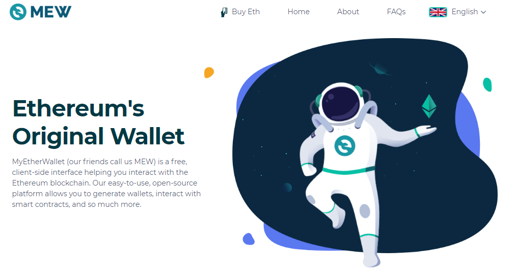

# 客户端/钱包

以太坊用户可以在钱包存储ETH，也可以与以太坊网络上的智能合约进行交互。许多钱包都有这些功能，下列是各式各样的钱包以及每种钱包的最佳用途的高度概述。

## 注意事项

重要的事放前面，如果之前从来没有使用过钱包，那么你最需要注意以下两点：

📌 学会妥善备份你的以太坊钱包！！！

📌 离线安全保存助记词！！！

## 智能合约钱包

智能合约钱包是具有独特强大功能的钱包。它们为用户提供了额外的安全性和恢复功能。

### 特征

🤩 双因素认证

😲 可通过家人或朋友的帮助恢复钱包

😁 像ATM机一样限制提现率

😗 设有个人白名单和黑名单

😜 欺诈警报和紧急封锁

### 移动智能合约钱包列表

1. [Gnosis Safe](https://safe.gnosis.io/) - Gnosis Safe旨在为所有用户提供一种方便、安全的方式来管理他们的资金，并与以太坊上的去中心化应用程序进行交互。

    2. [Argent](https://www.argent.xyz/) - 第一个适用于基于以太坊的加密货币和应用程序的智能钱包，带你体验未来的网络。

    3. [Authereum](https://authereum.org/) - Authereum是一个钱包供应商，也是一个dapp登录解决方案，它利用基于智能合约的账户、元交易、ENS服务等来给用户提供熟悉的无缝登录体验。

## 硬件钱包

硬件钱包是在线访问你的资金最安全的方法。因为签署交易时，硬件钱包不会公开你的私钥到互联网上。

硬件钱包也被称为“冷钱包”，它们离线存储加密资产，并将其置于所有者的手中，因此它提供了保护数字货币的最佳方法。

其他类型的钱包容易受到黑客攻击、网络钓鱼和破坏，从而导致资金损失。虽然人们由于移动或频繁交易，可能选择其他类型的钱包，但硬件钱包是较为理想的长期存储方式。硬钱包是为安全存储用户私钥而构建的设备。

它们大多数看起来像一个USB驱动器，可以通过桌面应用程序访问。

#### 🦸♂ 优点

🌼 在线时访问自己资金最安全的方法

🌼 比其他大多数与自身资金交互的方法更具非托管性、隐私性。

#### 🎯 缺点

❗ 具有成本

### Ledger

安全性颇高的硬件钱包，官方提供的软件功能较为局限。可以配合MyEtherWallet、 MetaMask 使用。

**优点:**

1. 防篡改，安全性高

**缺点:**

1. 官方软件功能差，无法调整 gas limit 和 gas price
2. 价格高并且国内较难购买

### Trezor

Trezor One 的设计目的是离线存储多种代币，格式简单易用，有两个按钮和一个屏幕。Model T 是 Trezor One 的升级版，去掉了两个按钮，变成了全彩色触摸屏。

虽然 Trezor One 已经可以与 Ledger Nano S 相媲美，但 Model T 的设计更安全，可以在设备上（而不是在计算机或移动设备上）进行PIN输入、密码输入和设备恢复。

Trezor Model T配有磁性码头（明确保管）。它也有一个密封装置，可以让你知道该设备是否已被攻破。Model T支持超过700种代币。

### 硬件钱包列表

1. [Ledger](https://shop.ledger.com/?r=22cab4d9225d) - 支持多种加密货币和通证

    2. [Lattice1](https://gridplus.io/lattice) - 使用Lattice1作为一个传统的硬件钱包，对允许重复支付订阅服务设置消费权限

    3. [Trezor](https://trezor.io/start/) - 原始硬件钱包

    4. [KeepKey](https://keepkey.myshopify.com/?afmc=1km&utm_campaign=1km&utm_source=leaddyno&utm_medium=affiliate) - 简易硬件钱包

    5. [BitBox](https://shop.shiftcrypto.ch/en/products/category/products-1/) - BitBox02是具有瑞士极简主义设计风格的硬件钱包

## 移动钱包

移动钱包和其他移动设备钱包是桌面钱包和网页钱包的移动版。移动或软件钱包是安装在计算机或智能手机（或任何其他设备）上的一种实用工具，用于处理公钥和私钥以及交易。一般情况下既可用于存储加密货币, 也可用于支付。

软件或移动钱包分为轻钱包和全节点钱包，轻钱包依赖第三方进行存储，而全节点钱包则不依赖第三方。经常使用的钱包中大多是轻钱包，包括 MyEtherWallet，imToken 和 Jaxx等等。

#### 🦸♂ 优点

🌼 访问自己的资金最方便的方式。

#### 🎯 缺点

❗ 依赖移动设备的安全性。

### MyEtherWallet

MyEtherWallet 作为一个轻钱包，上手难度不大，无需下载，在直接在网页上就可以完成所有的操作。

MyEtherWallet上生成的私钥由用户自我保管，平台方并无备份。

**优势:** 

1. 方便快捷，联网即可发起交易
2. 支持各种硬件钱包
3. 代码开源

**劣势:**

1. 交易时需要上传私钥（使用时认准唯一网址: [https://www.myetherwallet.com](https://www.myetherwallet.com) 谨防钓鱼网站 ）

**源码：**[https://github.com/kvhnuke/etherwallet](https://github.com/kvhnuke/etherwallet)

### TrustWallet

移动端以太坊钱包，支持以太坊、ERC 20、ERC 223和ERC 721代币，可以存储超过20,000种不同的基于ERC 20的代币。

**优势：**

1. 高级别的安全审计系统，用户钱包、私钥等信息本地化
2. 用户操作界面简单友好
3. 代码开源
4. 除了 IOS 和 Android 移动端之外，支持 mac OS 桌面版

**劣势：**

1. 功能比较少，但对于新手来说完全够用

**下载地址：**

mac OS & Android apk: [https://trustwallet.com/](https://trustwallet.com/)

App Store/Google Play

**源码：**[https://github.com/trustwallet/wallet-core](https://github.com/trustwallet/wallet-core)

### imToken

移动端钱包，操作简便，容易上手，功能齐全。在imToken上生成的钱包私钥保存在手机本地，平台方并无备份。

**优势:**

1. 移动端钱包，操作界面十分友好，联网即可发起交易
2. 中国团队，客服好沟通，反应速度快
3. iOS 和 Android 两个平台的代码开源
4. 衔接Dapp生态，便捷代币支付和智能合约调用
5. imToken 推出的支持蓝牙功能的硬件钱包 imKey 可以非常便捷的与手机端的 imToken 配合使用。详情点击：[https://imkey.im/?ref=imtokenweb&locale=zh-cn](https://imkey.im/?ref=imtokenweb&locale=zh-cn)

**劣势:**

1. 纯手机端

**下载地址：**App Store/Google Play

**源码：**[https://github.com/consenlabs](https://github.com/consenlabs)

### 移动钱包列表

1. [AlphaWallet](https://alphawallet.com/) - 支持本地dapp的以太坊钱包

    2. [Ambo](https://ambo.io/) - 针对主流群体的移动以太坊钱包

    3. [Argent](https://www.argent.xyz/) - 无交易费用的钱包

    4. [Balance](https://balance.io/) - 一个适用于iOS和Android系统的以太坊移动钱包。

    5. [Coinomi](https://www.coinomi.com/en/) – 多货币钱包

    6. [Coinbase Wallet](https://wallet.coinbase.com/) - 多货币钱包，可存储ERC-721收藏品

    7. [Cypher](https://www.cipherbrowser.com/) - 移动Dapp浏览器

    8. [Eidoo](https://eidoo.io/) - 同时设有去中心化交易所和DeFI网关的多货币和多平台钱包

    9. [eth-wallet-light](https://github.com/NoahZinsmeister/eth-wallet-light) -JS轻钱包的优化移动版钱包

    10. [imToken](https://token.im/) - 功能丰富的数字资产移动钱包，支持多链资产管理、DApp浏览和安全、私密的价值交换。

    11. [Jaxx](https://jaxx.io/) – 既是移动钱包，也是桌面钱包，支持Shapeshift。

    12. [Status](https://github.com/status-im/status-react) - 适用于以太坊的免费开源移动操作系统

    13. [Trust](https://github.com/TrustWallet/trust-wallet-ios) - 适用于ERC代币的手机钱包

    14. [Tokenary](https://tokenary.io/) - 具有跨设备同步功能和支持macOS系统的本地iOS钱包、DApp浏览器

    15. [WallETH](https://walleth.org/) - 安卓系统本地以太坊钱包

## 桌面钱包

电脑端钱包是可以在Windows、MacOS或Linux系统上操作的可下载应用程序，用户可使用他们的资金。

#### 🦸♂ 优点

🌼 能够离线创建/签署交易，这是与以太坊区块链交互最安全的方法。

🌼 非托管的钱包，并且比大多数其他与资金交互的方法更为私密。

#### 🎯 缺点

❗ 与其他访问资金的方法相比，离线使用时可能更麻烦。

### 桌面钱包列表

1. [MyCrypto](https://github.com/MyCryptoHQ) - 可从[https://download.mycrypto.com](https://download.mycrypto.com)下载的开源客户端工具，用于生成以太坊钱包，处理ERC-20代币，使与区块链进行交互更轻松。

    2. [Eidoo](https://eidoo.io/) - 带有去中心化交易所和DeFI网关的多币种、多平台（Windows，Mac，Linux，Android，iOs系统）钱包

    3. [Exodus](https://www.exodus.io/) - 允许多币种交互/交易的闭源钱包（要求在线生成交易）。

    4. [Fetch](https://hellofetch.co/download) - 支持以太坊和ERC-20代币的桌面（和网页）钱包，集成了20个显示实时汇率和具有一键式交易功能的交易所。

    5. [Tokenary](https://tokenary.io/masos) – 采用macOS系统的以太坊和ERC-20代币钱包，也是Safari浏览器的扩展程序，可存储资产并与DApp进行交互。

    6. [HUT34](https://wallet.hut34.io/) - 一个基于网页的以太坊钱包。

## 网页钱包

网页钱包是通过网页访问的钱包，用户钱包可以由网站代为管理，也可以充当用户生成账户和与账户交互的界面。

#### 🦸♂ 优点

🌼 可用性高

#### 🎯 缺点

❗ 依靠每个供应商自身提供良好的安全性和尊重用户隐私。

### MetaMask

MetaMask是一款在谷歌浏览器Chrome上使用的插件类型的以太坊钱包，该钱包不需要下载，只需要在谷歌浏览器添加对应的扩展程序即可，非常轻量级，使用起来也非常方便。

MetaMask会为用户创建12个英文助记词，一定要保存好助记词，在其他钱包导入新创建的账户的时候有可能需要这些助记词。

**优势:**

1. 通过添加钱包插件将Chrome变成兼容以太坊的浏览器
2. 狐狸logo设计太可爱了有没有
3. 支持各种硬件钱包

**劣势：**

1. 不支持自动显示ERC20代币。（需要用户自己添加代币的智能合约地址）

**官方下载地址:** [https://metamask.io/](https://metamask.io/)

**若无法使用Chrome浏览器直接下载：**[https://github.com/MetaMask/metamask-extension/releases](https://github.com/MetaMask/metamask-extension/releases)

### 网页钱包列表

1. [Metamask](https://metamask.io/) - Chrome扩展程序里的以太坊钱包，支持ERC代币

    2. [MyEtherWallet](https://github.com/MyEtherWallet) - 开源工具，可使与区块链交互更方便和安全

    3. [MyCrypto](https://github.com/MyCryptoHQ) - 开源的客户端工具，用于生成以太坊钱包、处理ERC-20代币以及使与区块链交互更方便容易

    4. [Portis](https://tor.us/) - 基于网页的钱包，方便用户登录到自己的DApp账户

    5. [Eth lightwallet](https://github.com/ConsenSys/eth-lightwallet) – 为节点与浏览器所用的JS轻钱包

    6. 
[SpankCard](https://github.com/SpankChain/SpankCard) - 一个浏览器内的以太坊钱包，设有支付渠道

    7. [Mnemonic generator](https://iancoleman.io/bip39/) - 生成单词助记符和相关的公钥/私钥对。选择“Ethereum”作为代币来生成以太坊地址。truffle-hd-wallet可用。

    8. [Fetch](https://hellofetch.co/download) - 支持以太坊和ERC-20代币的网页\(和桌面\)钱包。集合了20个交易所的实时交易率信息和一键交易功能。

    9. [Zerion](https://zerion.io/) - 网页钱包界面，集交易、借贷和投资一体的本地DeFi 服务。以集合已有钱包如Metamsk、WalletConnect、Uniswap的功能为特征。

    10. [Tokenary](https://tokenary.io/macos/) - macOS Safari浏览器扩展程序，可与Dapp交互。

## 客户端钱包

### [Geth](https://geth.ethereum.org/docs/install-and-build/installing-geth)

Geth钱包使用支票协议，可存储或验证链下和链上的信息，支持所有基于以太坊的网络，如以太坊、 xDai、 以太经典、POA和Ropsten、Goerli、Kovan、Rinkeby、Sokol等测试网。

Geth钱包是一个易于使用和具有安全性的以太坊钱包，支持本地ERC20, ERC721代币和Dapps。

Geth钱包还为以太坊开发者提供资源，开发者们无需使用专用钱包，只需将任何以太坊Dapp集成到Geth钱包中即可在钱包内本地运行各种Dapp。

### [Parity Fether](https://github.com/paritytech/fether/releases)

Parity Fether是一款可以在Windows、Mac和Linux系统上使用的轻客户端钱包。

当其他大多数钱包依赖中心化节点访问区块链时，Fether使用Parity的以太坊轻客户端以去中心化的方式访问区块链。

Parity Fether简单易用且功能强大，只需点击鼠标几次，即可创建以太坊账户以及接收、发送以太币和ERC20代币。

### [Parity Ethereum](https://github.com/paritytech/parity-ethereum/releases)

原以太坊基金会部分成员开发的钱包。功能强大的全节点钱包。

**优势**： 安全度高，不需要经过第三方发起交易

**劣势**：对网络要求高，需要连接节点才能发起交易

## 浏览器钱包

内置加密货币钱包的浏览器。

### Opera

新版本的Opera浏览器结合了易于使用的加密钱包功能，支持以太坊去中心化应用程序（Dapps）。

#### 🦸♂ 优点

🌼 用户可以使用浏览器与Dapp交互。

🌼 用加密货币支付购买商品。

🌼 依靠手机的安全系统锁来签署交易，因此用户无需记住任何密码也可使用钱包，易于使用

🌼 隐私度、匿名性高

#### 🎯 缺点

❗ 安全性可能较低。

## 第三方钱包

由第三方（通常在远程服务器上）存储的钱包，因此无论使用哪种计算机设备，都可以从任何地方轻松访问信息。

第三方钱包几乎可以称为网络钱包，所涉及的第三方通常是数字货币交易所。

#### 🦸♂ 优点

🌼 云计算功能

🌼 第三方将对其维护的所有钱包功能或其他方面进行必要的更改，并告知用户，而无需用户亲自进行任何更新。

#### 🎯 缺点

❗ 安全性较低

### 第三方钱包列表

1. [MyCrypto](https://mycrypto.com/) - 基于网页的以太坊钱包

    2. [TrustWallet ](https://trustwallet.com/)- 适用于iOS和Android系统的以太坊兼容钱包

    3. [MyEtherWallet](https://www.myetherwallet.com/) - 易于使用的以太坊钱包

