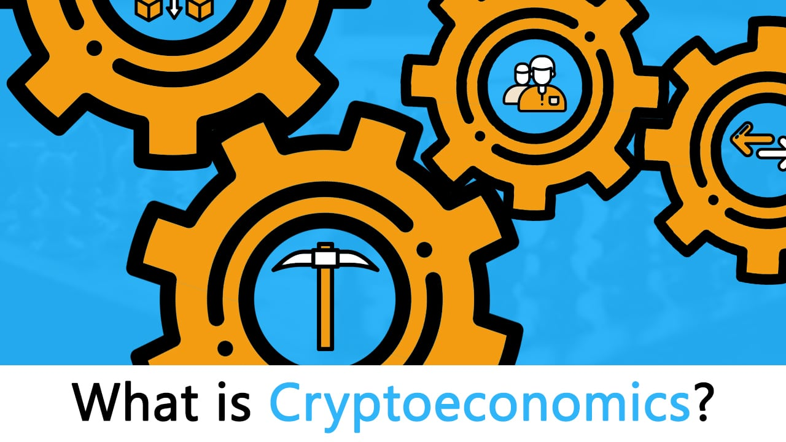

# 加密货币经济学

## 什么是加密货币经济学？

## What is Cryptoeconomics? The Ultimate Beginners Guide

  
What is cryptoeconomics? Ethereum developer Vlad Zamfir says that [cryptoeconomics](https://blockgeeks.com/guides/what-is-tokenomics/) is:

> **“A formal discipline that studies protocols that govern the production, distribution, and consumption of goods and services in a decentralized digital economy. Cryptoeconomics is a practical science that focuses on the design and characterization of these protocols.”**

The [blockchain technology](https://blockgeeks.com/guides/what-is-blockchain-technology/) runs on the principles of cryptoeconomics.

Let’s break it down. [Cryptoeconomics](https://blockgeeks.com/guides/what-is-tokenomics/) comes from two words: [Cryptography ](https://blockgeeks.com/guides/cryptocurrencies-cryptography/)and Economics. People tend to forget the “economics” part of this equation and that is the part that gives the blockchain its unique capabilities. The blockchain wasn’t the first time that a decentralized peer-to-peer system was used, torrent sites have used it for ages to share files. However, in every sense of the word, it has been a failure.

### Start Your Free Trial Today[ Free Trial](https://courses.blockgeeks.com/enrollment/?utm_source=Guides&utm_medium=Widget&utm_campaign=FromGuides)

### Why was peer-to-peer file sharing a failure?

In a [torrent system](https://en.wikipedia.org/wiki/Torrent_Systems), anyone can share their file with a decentralized network. The idea was that people would download them and keep seeding aka sharing the file with the network for others to download. The problem was that this worked on an honor system. If you were downloading a file, then you were expected to seed as well. The problem is that humans are not really the most honorable of creatures and without any economic incentives it made no sense for people to keep seeding a file which took up unnecessary space in their computers.

### Satoshi Nakamoto and the blockchain technology

In October 2008, an unknown man/woman/group calling themselves Satoshi Nakomoto released a paper which would lay the foundation for [bitcoin](https://blockgeeks.com/guides/what-is-bitcoin-a-step-by-step-guide/). This would shake the online community to its very foundations, for the first time we had a working model for something based in cryptoeconomics. The way it differed from earlier p2p decentralized systems, was that people now actually had an economic incentive to “follow the rules”. But more than that, the true genius of the blockchain technology lied in how it circumvented the Byzantine General’s Problem to create a perfect consensus system \(more on that later\).

### [https://www.youtube.com/watch?v=6RCtNrlzV28&feature=youtu.be](https://www.youtube.com/watch?v=6RCtNrlzV28&feature=youtu.be)

### 

### Cryptoeconomic properties of Bitcoin

So what are the properties that a cryptocurrency like [Bitcoin ](https://blockgeeks.com/guides/what-is-bitcoin-a-step-by-step-guide/)has as a result of cryptoeconomics?

**Let’s go through them one by and one:**

* It is based on the blockchain technology where each block contains the hash of the previous block and forms a continuous chain.
* Each block will include transactions.
* The blocks will have a particular state which is subject to change according to transactions. Eg. if A has 50 bitcoins and wants to send 20 bitcoins to B. Then The new state should show that A has 30 bitcoins left and B has 20 new bitcoins.
* The blockchain must be immutable. It should be possible to add new blocks but the old blocks can’t be tampered with.
* Only valid transactions should be allowed.
* The blockchain should be downloadable and anyone anywhere can easily access and check a particular transaction.
* Transactions could be added quickly to the blockchain if a sufficiently high transaction fee is paid.

### There are two pillars of cryptoeconomics as the name itself suggests:

* [Cryptography](https://blockgeeks.com/guides/cryptocurrencies-cryptography/).
* Economics.

Now let’s explore how these two lend the blockchain its unique characteristics.

### Cryptography

[Blockchain technology](https://blockgeeks.com/guides/what-is-blockchain-technology/) uses cryptographical functions for its operations. Let’s looks at some of the main functions that run the blockchain:

* [Hashing](https://blockgeeks.com/guides/what-is-hashing/).
* Signatures.
* [Proof of work](https://blockgeeks.com/guides/proof-of-work-vs-proof-of-stake/).
* [Zero Knowledge Proofs](https://blockgeeks.com/guides/what-is-zksnarks/).

### Hashing

In simple terms, [hashing means](https://blockgeeks.com/guides/what-is-hashing/) taking an input string of any length and giving out an output of a fixed length. Bitcoin uses SHA-256 to take in an input string of any length and giving an out hash of 256 bits. So what are the applications of hashing in cryptocurrency?

* Cryptographic hash functions.
* Data structures.
* Mining.

**Cryptographic hash functions:**

A cryptographic hash function has the following properties:

* **Deterministic:** An input A will always have the same output h\(A\) no matter how many times you parse it through the same hash function.
* **Quick Computation**: A function should return a hash of an input as quickly as possible.
* **Pre-Image resistance:** Given h\(A\) which is an output of a hash function, it should be infeasible to determine input A.
* **Collision resistance**: Given two inputs A and B and their hash outputs h\(A\) and h\(B\) it should be infeasible for h\(A\) = h\(B\).
* **Small changes**: in the input should drastically affect the output of the hash function.
* **Puzzle Friendly:** For every hash output Y and an input x. It is infeasible to find a value k, which will result in h\(k\|x\) = Y.

The cryptographic hash functions greatly help with security and mining in the blockchain.

### Data Structures:

The two data structures that are important in understanding the blockchain are Linked Lists and Hash Pointers.

* **Linked Lists:** Linked lists are blocks of data which are connected to one after another. This is an example of a linked list:

Each block in the list is pointing to the other via a pointer.

* **Pointer:** Pointers are variables which include the addresses of the other variables. So they are variables which are literally pointing towards the other variables.
* **Hash Pointers:** Hash pointers are basically pointers which not only has the address of other variables but also the hash of the data in that variable. So how does that help in the context of a blockchain?

**This is what a blockchain looks like:**

The blockchain is basically a linked list where each new block contains a hash pointer which points to the previous block and the hash of all the data in it. Just this one property leads into one of Blockchain’s greatest qualities….its immutability.

### How are blockchains immutable?

Suppose in the diagram above someone tries to tamper with the data in block 1. Remember that one of the properties of cryptographic hash functions is that a slight change in the input data will greatly change the output hash.

So, even if someone tries to tamper with the data in block 1 even slightly, it will change its hash drastically which is stored in Block 2. This will, in turn, result in the change of the hash of Block 2 which will result in the change of hash in block 3 and that will keep ongoing on and on till the end of the blockchain. This will freeze up the chain, which is impossible, so just like that, the chain is rendered tamper-proof.

Each block also has its own Merkle Root. Now, as you are already aware, every block has a lot of transactions. If the transactions were to be stored in a linear manner, it will be extremely cumbersome to go through all the transactions just to find a particular one.

### This is why we use a Merkle tree.

In a Merkle Tree, all the individual transactions are distilled down into one root via hashing. And this makes traversal very easy. So, if someone were to access a particular data in a block, instead of going through them linearly they can simply traverse using the hashes in the Merkle tree to get to the data:

### Mining

Crypto-puzzles are used in order to mine new blocks and for that hashing is critical as well. So the way it works is that there is a difficulty level that is set. After that, a random string called “nonce” is appended to the hash of the new block and hashed again. After that is it checked whether it is less than the difficulty level or not. If it is then the new block is added to the chain and a reward is given to the miner\(s\) responsible. If it isn’t less than the difficulty, the miners keep changing the nonce and wait for a value which would be less than the difficulty.

As you can see, hashing is a critical part of blockchain and cryptoeconomics.

### Signatures

One of the most important cryptographical tools that are used in cryptocurrency is the concept of signatures. What is a signature in real life and what are its properties? Imagine a paper that you have signed with your signature, what should a good signature do?

* It should provide verification. The signature should be able to verify that it is you who actually signed the paper.
* It should be non-forgeable. No one else should be able to forge and copy your signature.
* Non-repudiation. If you have signed something with your signature, then you should not be able to take it back or claim that someone else has done it instead of you.

In the real world, however, no matter how intricate the signature, there are always chances of forgery, and you cannot really verify signatures using simple visual aids, it is very inefficient and non-reliable.

Cryptography gives us a solution using the concept of public and private key. Let’s see how the two keys work and how it fuels the cryptocurrency system. Suppose there are two people, Alan and Tyrone. Alan wants to send some very important data and Tyrone needs to authenticate that the data actually came from Alan. The way they are going to do it is by using Alan’s public and private key.

One important thing to note: It is infeasible to determine one’s public key from one’s private key. The public key is public as the name states, and anyone can have that key. The private key, however, is something that only you should have and you must NOT share it with anyone.

So, let’s go back to Alan and Tyrone if they are to exchange messages using the keys how will it look?

Suppose Alan wants to send a message “m”. Alan has a private key Ka- and a public key Ka+. So when he sends the message the Tyrone he will encrypt his message with his private key so the message becomes Ka-\(m\). When Tyrone receives the message he can retrieve the message by using Alan’s public key, Ka+\(Ka-\(m\)\) and retrieves the original message “m”.

**To summarize:**

* Alan has a message “m” which he encrypts with his private key Ka- to get encrypted message Ka-\(m\).
* Tyrone then uses Alan’s public key Ka+ to decrypt the encrypted message Ka+\(Ka-\(m\)\) to get the original message “m”.

**Check out this diagram for a visual representation:**

**Verification**: If the encrypted message gets decrypted by using Alan’s public key then it verifies 100% beyond proof that Alan was the one who sent the message.

**Non-Forgeable:** If someone, say, Bob, intercepts the message and sends his own message with his private key, Alan’s public key won’t decrypt it. Alan’s public key can only decrypt messages encrypted with his private key.

**Non-Repudiable**: Similarly, if Alan says something like, “I didn’t send the message, Bob did” and Tyrone is able to decrypt the message using Alan’s public key, then this shows that Alan is lying. This way he can’t take back the message that he sent and put the blame on anyone else.

**Applications in cryptocurrency:** Now suppose Alan is sending some transaction “m” to Tyrone. He will first hash his transactions using a hash function. And then encrypt it using his private key. Tyrone knows that he is getting a transaction “m”, so he can then decrypt the message using Alan’s public key and compare the hashes of the of the resulting decryption with the hash of the transaction “m” that he has already. As hash functions are deterministic and will always give the same output to the same input, Tyrone can easily determine that Alan did indeed send that exact same transaction and there was no malpractice involved.

**In simpler terms:**

* Alan has a transaction “m” and Tyrone knows that he is getting “m” as well.
* Alan hashes m to get h\(m\).
* Alan encrypts the hash with his private key to get Ka-\(h\(m\)\).
* Alan sends the encrypted data to Tyrone,
* Tyrone uses Alan’s public key to decrypt Ka+\(Ka-\(h\(m\)\)\) to get the original hash h\(m\).
* Tyrone can then hash the “m” that he originally had to get h\(m\).
* If h\(m\) = h\(m\), as it should be because hash functions are deterministic, then this means that the transaction was free of malpractice.

### Proof Of Work

When miners “mine” to form new blocks to add to the blockchain, the consensus system by which the blocks get approved and added is called “proof-of-work”. Miners use heavy duty computational power to solve cryptographical puzzles to satisfy a difficulty level. This is one of the most path-breaking mechanisms in blockchain technology. Earlier decentralized peer-to-peer digital currency systems used to fail because of something called the “Byzantine General’s Problem”. The proof-of-work consensus system finally provided a solution to this problem.

**What is the Byzantine General’s Problem?**

Ok so imagine that there is a group of Byzantine generals and they want to attack a city. They are facing two very distinct problems:

* The generals and their armies are very far apart so centralized authority is impossible, which makes coordinated attack very tough.
* The city has a huge army and the only way that they can win is if they all attack at once.

In order to make successful coordination, the armies on the left of the castle send a messenger to the armies on the right of the castle with a message that says “ATTACK WEDNESDAY.” However, suppose the armies on the right are not prepared for the attack and say, “NO. ATTACK FRIDAY” and send back the messenger through the city back to the armies on the left. This is where we face a problem. A number of things can happen to the poor messenger. He could get captured, compromised, killed and replace with another messenger by the city. This would lead to the armies getting tampered information which may result in an uncoordinated attack and defeat.

This has clear references to blockchain as well. The chain is a huge network; how can you possibly trust them? If you were sending someone 4 Ether from your wallet, how would you know for sure that someone in the network isn’t going to tamper with it and change 4 to 40 Ether?

Satoshi Nakamoto was able to bypass the Byzantine General’s problem by inventing the proof of work protocol. This is how it works. Suppose the army on the left want to send a message called “ATTACK MONDAY” to the army on the right, they are going to follow certain steps.

* Firstly, they will append a “nonce” to the original text. The nonce can be any random hexadecimal value.
* After that, they hash the text appended with a nonce and see the result. Suppose, hypothetically speaking, the armies have decided to only share messages which, on hashing, gives a result which starts with 5 zeroes.
* If the hash conditions are satisfied, they will send the messenger with the hash of the message. If not, then they will keep on changing the value of the nonce randomly until they get the desired result. This action is extremely tedious and time-consuming and takes a lot of computation power.
* If the messenger does get caught by the city and the message is tampered with, according to hash function properties, the hash itself will get drastically changed. If the generals on the right side, see that the hashed message is not starting with the required amount of 0s then they can simply call off the attack.

However, there is a possible loophole.

No hash function is 100% collision-free. So what if the city gets the message, tampers with it and then accordingly change the nonce until they get the desired result which has the required number of 0s? This will be extremely time-consuming but it is still possible. To counter this, the generals are going to use strength in numbers.

Suppose, instead of just one general on the left sending messages to one general on the right, there are 3 generals on the left who have to send a message to the ones on the right. In order to do that, they can make their own message and then hash the cumulative message and then append a nonce to the resulting hash and hash it again. This time, they want a message which starts with six 0s.

Obviously, this is going to be extremely time-consuming, but this time, if the messenger does get caught by the city, the amount of time that they will take to tamper the cumulative message and then find the corresponding nonce for the hash will be infinitely more. It may even take years. So, eg. if instead of one messenger, the generals send multiple messengers, by the time the city is even halfway through the computation process they will get attacked and destroyed.

The generals on the right have it pretty easy. All they have to do is to append the message with the correct nonce that will be given to them, hash them, and see whether the hash matches or not. Hashing a string is very easy to do. That, in essence, is the process behind proof-of-work.

* The process of finding the nonce for the appropriate hash target should be extremely difficult and time-consuming.
* However, the process of checking the result to see if no malpractice has been committed should be very simple.

### Zero Knowledge Proofs.

What is a [zero knowledge proof](https://blockgeeks.com/guides/what-is-zksnarks/) \(zkp\)? ZKP basically means that a person A can prove to person B that they have knowledge of a certain piece of information without telling them what that knowledge specifically is. In this example, the person A is the prover and the person B is a verifier. In cryptography, this becomes especially useful because this helps in proving an extra layer of privacy for the prover.

**For a ZKP to work it needs to satisfy certain parameters:**

* **Completeness:** If the statement is true then an honest verifier can be convinced of it by an honest prover.
* **Soundness:** If the prover is is dishonest, they can’t convince the verifier of the soundness of the statement by lying.
* **Zero-Knowledge:** If the statement is true, the verifier will have no idea what the statement actually is.

An example of a ZKP is the Alibaba cave, let’s see how it works. In this example, the prover \(P\) is saying to the verifier\(V\) that they know the password of the secret door at the back of the cave and they want to prove it to the verifier without actually telling them the password. So this is what it looks like:

Image courtesy: Scott Twombly \(YouTube channel\)

The Prover goes down any of the paths A and B, suppose they initially decide to go through path A and reach the secret door at the back. When they do so, the verifier V comes in at the entrance, with no knowledge of which path the prover actually took and declares that they want to see the prover appear from path B.

In the diagram, as you can see, the prover does indeed appear in path B. But what if this was dumb luck? What if the prover didn’t know the passcode, and took the path B, was stuck at the door and by sheer fortune, the verifier told him to appear from path B, the one they were originally on anyway?

So, to test the validity, the experiment is done multiple times. If the prover can appear at the correct path every single time, it proves to the verifier that the prover indeed knows the password even though the verifier doesn’t know what the password actually is.

### What is the application of ZKP in blockchain?

Many blockchain based technologies are using Zk-Snarks, in fact, even [Ethereum](https://blockgeeks.com/guides/what-is-ethereum/) in its Metropolis phase is planning to bring in [Zk-Snarks ](https://blockgeeks.com/guides/what-is-zksnarks/)and add it to its arsenal. Zk-Snarks stands for “Zero-Knowledge Succinct Non-Interactive Argument of Knowledge” and it proves a computational fact about the data without revealing the data itself.

They can be used to generate a proof of statement to verify each and every transaction by just taking a simple snapshot of each transaction which is enough to prove to the receiving side that a transaction was done without revealing the transaction itself.

**This achieves two things:**

* The integrity and privacy of the transaction is maintained.
* By not revealing the inner workings of the entire transaction the system maintain abstraction which makes it infinitely easier to use.

So these are some of the important cryptographical functions which are being used by the blockchain. Now let us look at the second pillar, Economics.

### Economics

Like we mentioned in the beginning, the place where blockchain differs from other decentralized peer-to-peer system is that it gives its users financial and economic incentives to get some work done. Like with any solid economic system, there should be incentives and rewards for people to get work done, similarly, there should be a punishment system for miners who do not act ethically or do not do a good job. We will see how the blockchain incorporates all these basic economic fundamentals.

#### [Must Read: Cryptocurrency Game Theory ](https://blockgeeks.com/guides/cryptocurrency-game-theory/)

**There are two sets of incentives that participants in the blockchain have:**

**Incentive Set \#1**

* **Tokens:** The actors who actively participate and contribute to the blockchain get assigned cryptocurrencies for their efforts.
* **Privileges**: Actors get the decision-making rights which gives them the right to charge rent. Eg. Miners who mine a new block become the temporary dictator of the block and decide which transactions go in. They can charge transaction fees to include transactions within the block itself.

**Incentive Set \#2**

* **Rewards:** Good participants get a monetary reward or decision-making responsibility for doing well.
* **Punishments:** Bad participants have to pay a monetary fine or they have their rights taken away for behaving badly

### How do cryptocurrencies have value?

Cryptocurrencies have value because of the same reason that money, in general, has value, trust. When people trust a commodity and give it value, it becomes a currency, that’s the same reason why fiat has value and why gold had value in the first place. So when a given commodity is given value, the value changes in accordance with one of the oldest rules in economics, called Supply and Demand.

### What is Supply and Demand?

This is the supply-demand graph and one of the most common things that you will see as in economics. As you can see, the demand for the commodity is in an inverse proportion with its supply. The spot where the two graphs meet is the equilibrium i.e. the sweet spot where you want to be. So, let’s use this logic for cryptocurrency and, in general, bitcoin.

The[ supply of bitcoins](https://blockgeeks.com/guides/how-to-buy-bitcoin/) is fixed at 21 million. That’s the market cap on all bitcoins. Since the total number is fixed there are several things that need to be considered when it comes to the supply of bitcoin. Because of this, certain regulations need to be made to make sure that bitcoins become progressively harder to mine. If these steps are not taken, the miners will mine indiscriminately, pumping out the remaining bitcoins and putting it in the market, decreasing its overall worth.

In order to make sure that miners don’t pump out all the bitcoins at once the following steps are taken:

* A new block is added to the chain only at the interval of 10 mins which leads to a reward of 25 bitcoins. The time has to be fixed to make sure that miners don’t just keep adding blocks to the chain with no regulations.
* The second thing that the bitcoin protocol does is that it constantly increases the difficulty level. As explained above, during the mining process the hash of the block along with the nonce needs to be less than a particular number. This number is called the “difficulty level” and usually begins with a number of zeroes. As the difficulty increases the number of zeroes increases as well.

With these two factors and the fact that mining has become a lot more specialized process which includes humongous investment, the entire process makes sure that the supply of bitcoins in the market is kept at check. And this is true for all cryptocurrencies, using proof of work, as well.

**The Demand of the cryptocurrency depends on a lot of factors:**

* What is the history of the currency?
* Has it been subject to a hack lately?
* Does it consistently generate results?
* [How good is the team behind it](https://blockgeeks.com/guides/ico-basics/)?
* Does it have potential to become better?
* How much is the hype around it?

All these factors determine how “hot” the currency is and as a result, the value shifts depending on its demand.

### The Game theory in blockchain

So how does an unregulated, decentralized peer to peer system remain honest? Miners have a lot of power and they can easily commit crimes and get away with it. This is where all the previous attempts at a decentralized system failed, users are humans and humans are prone to “bad” behavior. So how do you keep a decentralized system of humans honest? The answer lies in one of the most fundamental economic ideas: [Game Theory](https://blockgeeks.com/guides/cryptocurrency-game-theory/).

Game theory is basically the study of strategic decision-making. Making decisions which make the most sense to you, keeping in mind the decision of the competitors is basically what game theory is all about. One of the most fundamental concepts of game theory is the “Nash Equilibrium”.

### What is Nash Equilibrium?

A Nash Equilibrium is a state where a party takes the most optimal strategy keeping in mind the actions of the other party and they can’t gain anything by changing around their strategy. Let’s see an example of the Nash Equilibrium in action.

Now consider the above table that we call a “Payoff Matrix”. The numbers are units of payoffs that a person will get upon taking \(or not taking an action\). So let’s analyze:

**If A Takes Action:**

Then B has a payoff of 4 if it takes action and 0 payoff if it doesn’t take action. So the optimal strategy for B is to take action.

**If A Doesn’t take Action:**

Once again, B has 0 payoffs for not taking action and a payoff of 4 if it does take action.

So we can conclude that regardless of what A does, B’s best strategy lies in taking action. Now, similarly, let’s checkout the what is the best strategy for A.

**If B takes Action:**

A has a payoff of 0 for not taking action and a payoff of 4 for taking action. So the best way for A is to take action.

**If B doesn’t take Action:**

A has a payoff of 0 for not taking action and a payoff of 4 for taking action.

So, regardless of what B does, A’s the best way forward is to take action.

We can hence conclude that for both A and B the best way to go ahead is to take action.

**Hence the Nash Equilibrium is:**

When both of them take action.

Now, what is the application of the Nash Equilibrium in the blockchain? Well, it won’t be a stretch to say that the blockchain exists and the miners remain honest BECAUSE the chain itself is in a self-imposing Nash Equilibrium.

**Let’s take an example:**

Consider the above blockchain. The blue blocks 1,2 and 3 are part of the main chain. Now suppose a malicious miner mines a block 2A and is attempting a hardfork for his own financial gains. What is stopping the other miners from joining him and mining on the new block?

Well, the miners have a very hard and fast rule, any block that is mined on an invalid block is not considered a valid block. So, the other miners will simply ignore the invalid block and keep mining on the old chain anyway. Remember, all currency works on trust and perceived value, so the currency that the malicious miner may mine from the new block will not be considered of any value at all. And remember, mining is a very expensive process, so why will anyone waste so much resource on a block that may or may not even be considered valid?

Now you may be thinking, what if a lot of miners decide to join the new miner and mine on the new block? The problem with that is that the blockchain network is a huge and widely distributed network wherein communication and coordination is next to impossible. Keeping that in mind, a coordinated attack like that on the blockchain is infeasible. Most miners will simply choose the route where they get a maximum payoff, and this way the Nash Equilibrium of the main chain is maintained.

### Punishment in the blockchain

Like with any efficient economic systems, good actions should be rewarded and negative actions should be punished. How does punishment work in a game theory model? Imagine a payoff matrix where the payoff for the participants is high but the implication on the society, in general, is very high. Eg.

Suppose there are two people A and B and they are both about to commit a crime. Now according to the matrix, the payoff for both of them is high when they commit a crime so their Nash Equilibrium lies in both committing a crime. Now while this does make sense logically, the implications on the society, in general, is very bad. Humans, more of than not, are motivated by personal greed and not everyone is altruistic. If this were to hold true, the world will be a terrible place to live in. So, how did humans counteract this? By introducing the concept of punishment.

Suppose we have a system where for every -0.5 of utility taken for them public, there will be a punishment factor of -5 on everyone who commits a crime. So, let’s add the punishment factor on the payoff matrix above and see how that changes the table:

As you can see above, the payoffs change drastically and the Nash Equilibrium changes to \(1,1\), as in both don’t commit a crime. Now, punishment is expensive, a utility of -0.5 is taken from the society after all. So what is the incentive for society to join the punishment game? The way this question was answered was by making punishment mandatory for everyone i.e. anyone who is not participating in the punishment game is punished as well. An example of this is a tax-driven police force. The police can punish the perpetrators but a utility in the form of tax is taken from the public. Anyone who doesn’t pay the tax and participate in the game is considered a criminal themselves and punished accordingly.

In a blockchain, any miners who are not following the rules and mining illegal blocks are punished by having their privileges taken away and risk social ostracization. The punishment becomes even more severe when [proof-of-stake](https://blockgeeks.com/guides/proof-of-work-vs-proof-of-stake/) is involved \(more on this later\). By using simple game theory and punishment system, the miners are kept honest.

### More incentives for miners

When a miner\(s\) successfully mines a block, they become the temporary dictator of that block. It is completely their jurisdiction as to which transactions go in the block and the speed of the said transactions. For the transactions to be included, they can charge a transaction fee. This incentivizes the miners because they get additional financial rewards OVER the reward they gain from mining a new block anyway \(25 BTC in bitcoin and 5 Eth in Ethereum\).

In order to make the system fair and to make sure that not the same miners get to mine new blocks and collect the rewards every single time, the mining difficulty level is adjusted periodically. This makes sure that the miners who get to mine a new block is completely random. Over the long run, mining is a zero sum gain, in other words, the profits that a miner gets from mining a new block eventually gets adjusted because of the costs of mining.

**P+Epsilon Attack**

A proof of work system, however, is vulnerable to a particular type of attack called the “P+ epsilon attack”. In order to understand how this attack works we must define some terms beforehand.

Un-Coordinated Choice Model: An uncoordinated choice model is a model where all the participants don’t have the incentive to work with one another. The participants may form groups but at no time is the group big enough to become a majority.

**Coordinated choice model:**  This is a model where all the participants coordinate because of a common incentive.

Now it is assumed that the blockchain is an uncoordinated model, but what if there is an incentive for the miners to do an action which goes against the integrity of the blockchain? What if there is a bribe involved to make the miners take a particular action? This is where the bribing attacker model comes in.

### What is the bribing attacker model?

Imagine an uncoordinated model. Now, what if an attacker enters the system and incentivizes the miners to coordinate with each other after giving them a bribe? This new model is called a bribing attacker model. In order to successfully bribe the system, the attacker must have two resources:

* **Budget**: The total amount of money that the attacker has that they are willing to pay to make the miners take a particular action.
* **Cost:** The price that the miner actually ends up paying.

However, if an attacker does decide to attack the blockchain, we arrive in an interesting conundrum… and this is where the “p + epsilon attack” comes in. For reference check out this table:

Image courtesy: Vitalik Buterin Presentation.

Imagine a simple game such as an election. If the people vote for a particular person if they vote the same way everyone is voting, then they get a payoff but otherwise, they don’t. Now imagine, that a briber enters the system and lays down this condition to an individual. If you vote AND the others don’t vote, then you will get a payoff of “P + ε”. The usual payoff AND an extra bribe of ε on top of that.

**So now, the payoff matrix looks like this:**

Image courtesy: Vitalik Buterin Presentation.

Now imagine this scenario, everyone involved in this game gets to know that if they vote anyway, then there is a chance that they may get a payoff, but if they don’t vote then there is a 50-50 chance of them getting a payoff.

What do you think the players will do then? Of course, they are going to vote to get a guaranteed payoff. Now, this is where things get interesting. As can be seen in the matrix, the briber only has to pay the bribe “ε” when only person votes while the others don’t. However, in this situation, since everyone is voting, the Nash equilibrium shifts to:

That’s right, the briber didn’t even need to pay the bribe!

**So, let’s approach this problem from the POV of the briber:**

* Convince the group to vote a particular way.
* Achieve the goal without even having to pay the bribe.

It is a huge win-win scenario for the briber and this has heavy implication on the blockchain especially in a proof-of-work system. Let’s check out our old hypothetical blockchain again:

Suppose the briber really wants the chain to hardfork and declares that a group of miner who opts to join the new chain will get a bribe of ε, this will incentivize the entire miner community to coordinate and join the new chain. Obviously the bribe has to be extremely high for something like this to happen, but as we have seen in the briber attacker model above, the attacker won’t even need to pay the said amount. According to Vitalik Buterin, this is one of the biggest problems of the proof of work system, its vulnerability to the P + epsilon attack.

### The solution lies in proof of stake.

The solution to this form of incentive driven attack lies in proof of stake. In this system, the miners have to put up a portion of their personal fortune and invest it in future blocks. As an economic system, this is much better because the punishment in it is way more severe. Instead of having their rights taken and getting away with a “tap to their knuckles”, miners now face the very real possibility of their stake and fortune being taken away.

So, how does this help in preventing P + epsilon attacks? Put yourselves in a miner’s shoes. You have a part of your fortune invested inside a block which is to be added in the main chain. Now a briber comes and tells you that you can get an extra payoff if you make your block join the main chain. BUT, if the chain doesn’t get approved then there is a huge risk of you losing all the money that you have invested in the block. Plus, as the P + Epsilon attack states, you won’t even get the extra payoff from the bribe. For a miner, once that they have invested a stake, it is a no brainer for them to continue in the main chain and not to get involved in any malicious activities.

### Cryptoeconomics: Conclusion

So as you can see, cryptography and economics have combined in a very beautiful and intricate manner to create the [blockchain technology.](https://blockgeeks.com/guides/what-is-blockchain-technology/) The growth that it has experienced over the last few years is staggering and it is only going to get better and more widely used.

#### Like what you read? Give us one like or share it to your friends

1,534[27](https://blockgeeks.com/guides/what-is-cryptoeconomics/#comments)Have a question? [Ask our Community](https://blockgeeks.com/abg/)1,534[27](https://blockgeeks.com/guides/what-is-cryptoeconomics/#comments)



