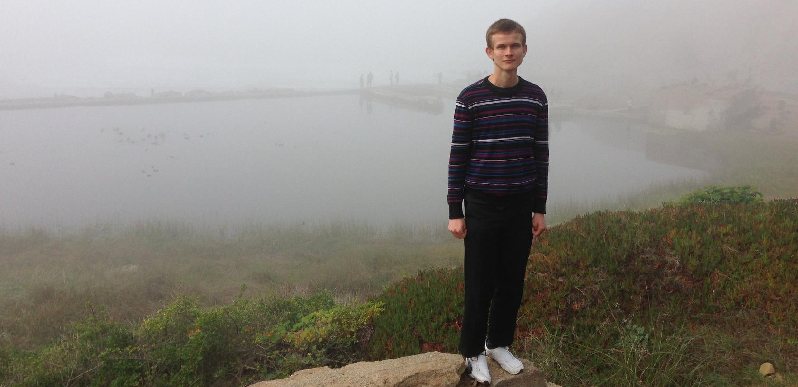

# 天才Vitalik Buterin

## 天才出少年

## VITALIK BUTERIN

### Zug, Switzerland



\#Copy-paste bio for conferences, articles, propaganda materials, etc:


```text
Vitalik is the creator of Ethereum. He first discovered blockchain and cryptocurrency technologies through Bitcoin in 2011, and was immediately excited by the technology and its potential. He cofounded Bitcoin Magazine in September 2011, and after two and a half years looking at what the existing blockchain technology and applications had to offer, wrote the Ethereum white paper in November 2013. He now leads Ethereum's research team, working on future versions of the Ethereum protocol.
```

\#More interesting bio

I was born in 1994 in Russia and moved to Canada in 2000, where I went to school. I happily played World of Warcraft during 2007-2010, but one day Blizzard removed the damage component from my beloved warlock's Siphon Life spell. I cried myself to sleep, and on that day I realized what horrors centralized services can bring. I soon decided to quit.

In 2011, searching for a new purpose in life, I discovered Bitcoin. At first, I was skeptical, and did not understand how it could possibly have value without physical backing. But slowly I became more and more interested. I started writing for a blog called Bitcoin Weekly initially at a meek wage of $1.5 per hour, and soon with Mihai Alisie cofounded Bitcoin Magazine.

In 2012, I entered the University of Waterloo; in 2013 I realized that crypto projects were taking up 30h/week of my time, so I dropped out. I went around the world, explored many crypto projects, and finally realized that they were all too concerned about specific applications and not being sufficiently general - hence the birth of [Ethereum](http://ethereum.org/), which has been taking up my life ever since.

Age: 25 \(for now\)

Residence: Cathay Pacific Airlines

Political affiliation: Intellectual hipster meta-contrarian

Drinks/smokes/drugs: green tea

Religion: crypto

Occupation: It's complicated

* WORK
  * Egora
* EDUCATION
  * University of Waterloo
  * The Abelard School
  * Life

## 个人网站


## Twitter




